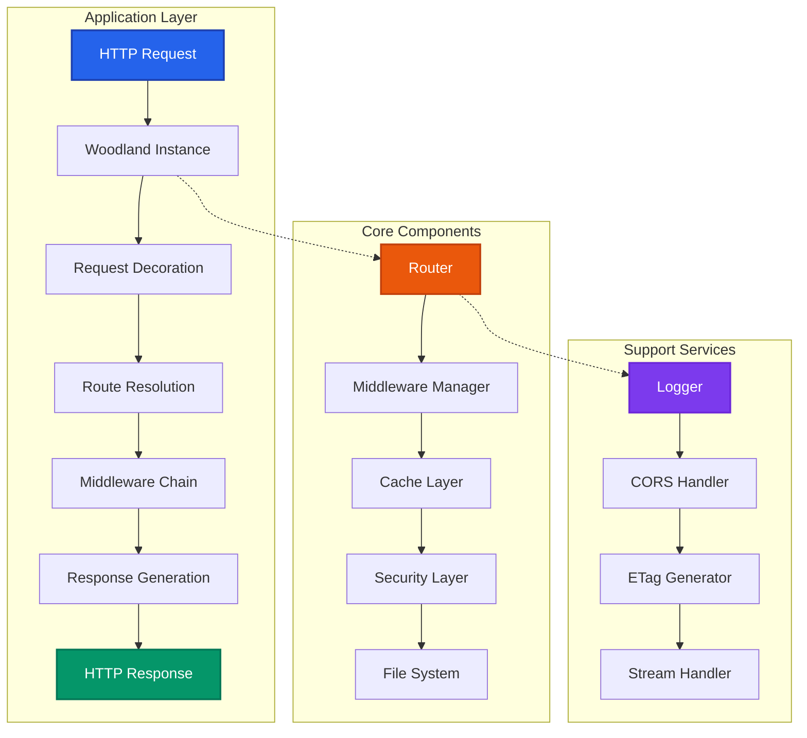
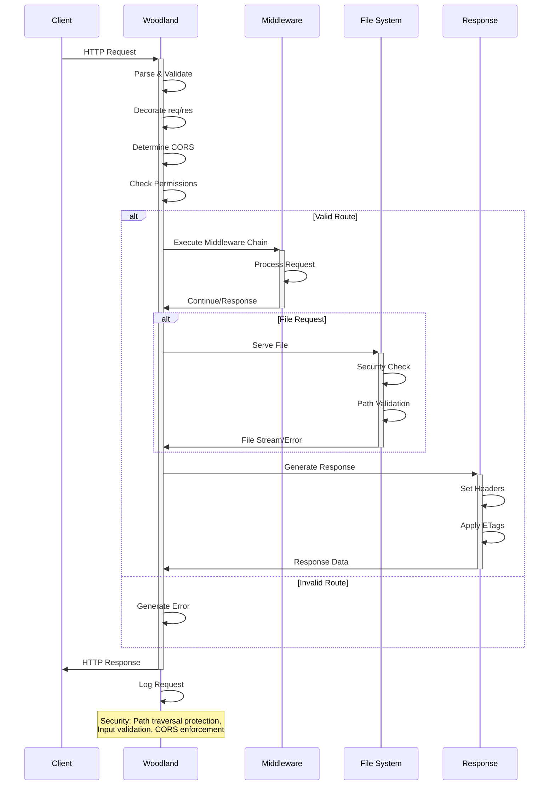
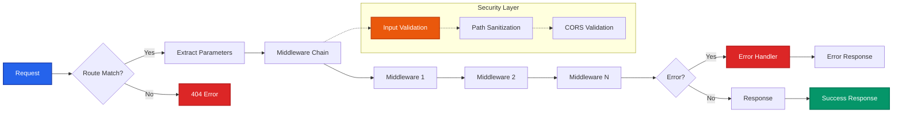
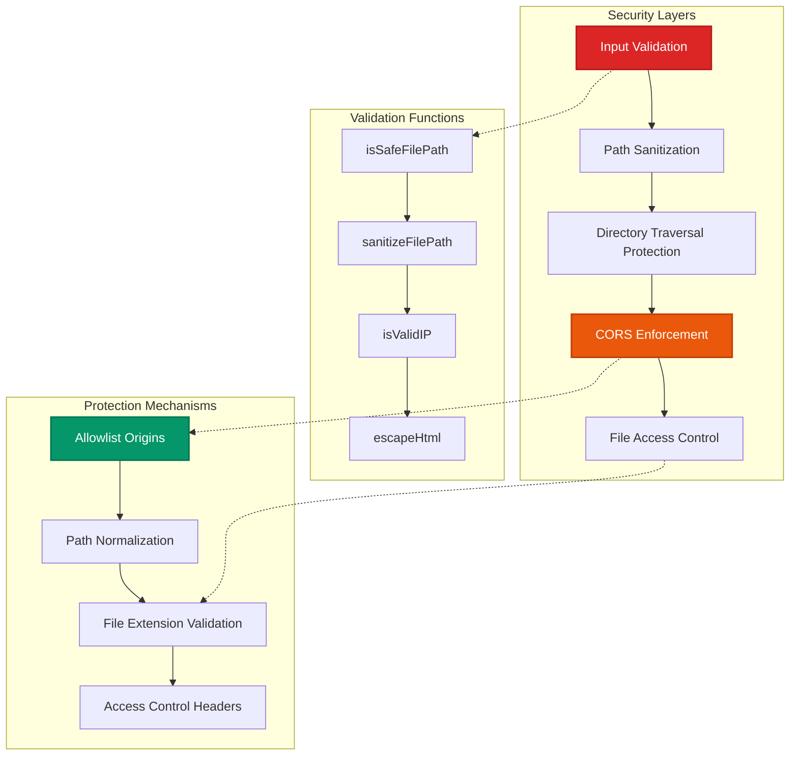
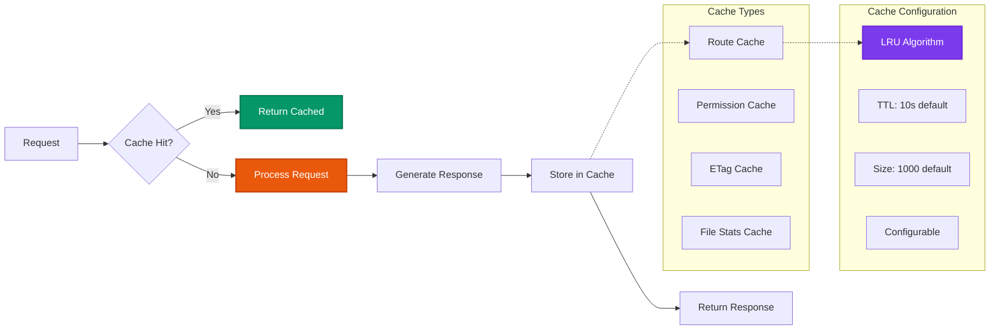
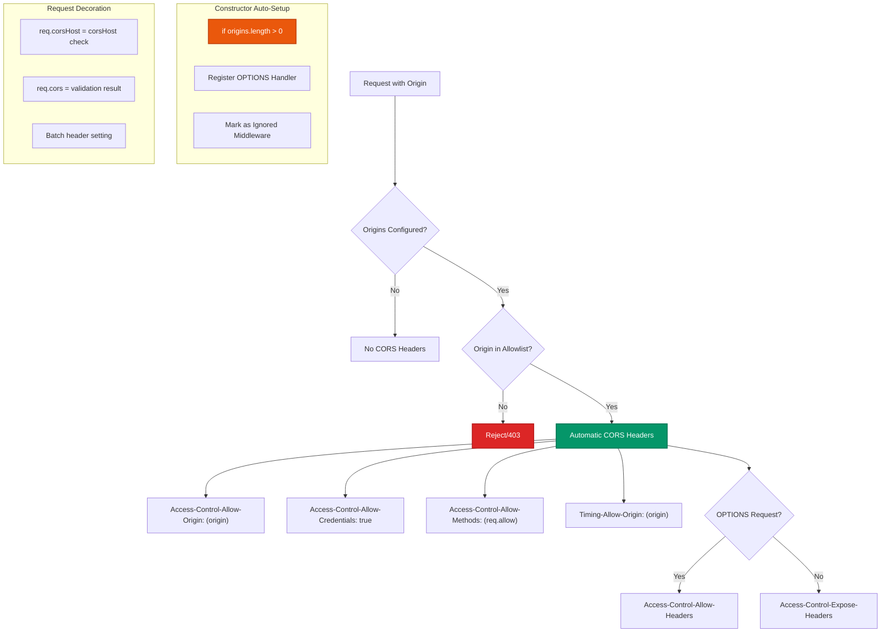
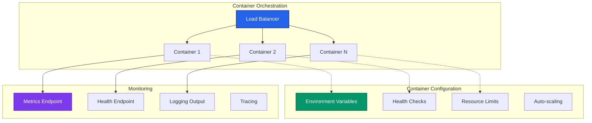
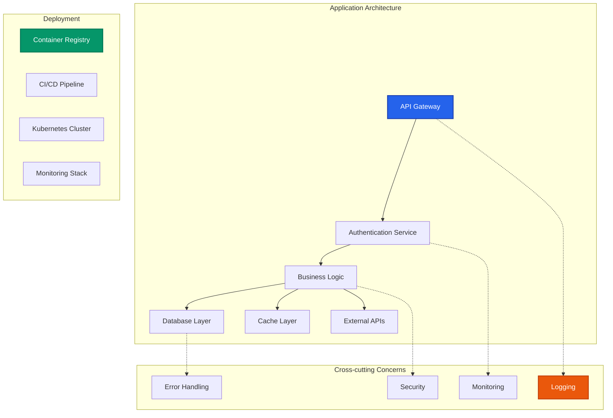

# Woodland HTTP Server Framework - Technical Documentation

## Table of Contents

1. [Overview](#overview)
2. [Architecture](#architecture)
3. [Data Flow](#data-flow)
4. [Core Components](#core-components)
5. [Mathematical Foundation](#mathematical-foundation)
6. [Security Features](#security-features)
7. [OWASP Security Assessment](#owasp-security-assessment)
8. [Performance Characteristics](#performance-characteristics)
9. [Test Coverage](#test-coverage)
10. [Usage Examples for 2025](#usage-examples-for-2025)
11. [API Reference](#api-reference)
12. [Deployment Patterns](#deployment-patterns)
13. [Best Practices](#best-practices)

---

## Overview

Woodland is a lightweight, security-focused HTTP server framework for Node.js that extends EventEmitter. It provides a middleware-based architecture with built-in features for modern web applications including CORS handling, file serving, caching, and comprehensive logging.

### Key Features

- **Middleware-based routing** with parameter extraction
- **Security-first design** with path traversal protection and input validation
- **Built-in CORS support** with configurable origins
- **ETag generation** for efficient caching
- **File serving** with auto-indexing capabilities
- **Stream support** for handling large files
- **LRU caching** for performance optimization
- **Comprehensive logging** with Common Log Format support
- **TypeScript definitions** included

### Target Use Cases

- **API servers** and microservices
- **Static file serving** with security
- **Edge computing** applications
- **Real-time** applications with EventEmitter integration
- **Container-based** deployments
- **Development servers** with auto-indexing
- **CLI tool** with comprehensive test coverage

---

## Architecture

The Woodland framework follows a layered architecture pattern with clear separation of concerns:



### Component Responsibilities

- **Woodland Instance**: Central orchestrator extending EventEmitter
- **Router**: Route matching and parameter extraction
- **Middleware Manager**: Execution chain management
- **Cache Layer**: LRU caching for routes and permissions
- **Security Layer**: Input validation and path traversal protection
- **File System**: Secure file serving with auto-indexing

---

## Data Flow

### Request Processing Flow



### Middleware Execution Flow



---

## Core Components

### Woodland Class

The main class extending EventEmitter that orchestrates all operations:

```javascript
class Woodland extends EventEmitter {
  constructor(config = {}) {
    // Configuration options:
    // - autoindex: Enable directory listing (default: false)
    // - cacheSize: LRU cache size (default: 1000)
    // - cacheTTL: Cache TTL in ms (default: 10000)
    // - charset: Default charset (default: 'utf-8')
    // - corsExpose: CORS headers to expose to client (default: '')
    // - defaultHeaders: Default HTTP headers (default: {})
    // - digit: Timing precision digits (default: 3)
    // - etags: Enable ETag generation (default: true)
    // - indexes: Index file names (default: ['index.htm', 'index.html'])
    // - logging: Logging configuration (default: {})
    // - origins: CORS allowed origins (default: [])
    // - silent: Disable default headers (default: false)
    // - time: Enable response time tracking (default: false)
  }
}
```

### Security Architecture



### Caching Strategy



---

## Mathematical Foundation

### Formal Mathematical Model

Woodland's behavior can be formally described using mathematical notation, providing a rigorous foundation for understanding the framework's operations.

#### Request-Response Function

The core request processing function can be modeled as:

$$\mathcal{W}: \mathbb{R} \times \mathbb{C} \times \mathbb{M} \rightarrow \mathbb{S} \times \mathbb{H} \times \mathbb{B}$$

Where:
- $\mathbb{R}$ = Set of HTTP requests
- $\mathbb{C}$ = Configuration space
- $\mathbb{M}$ = Middleware set
- $\mathbb{S}$ = HTTP status codes
- $\mathbb{H}$ = Response headers
- $\mathbb{B}$ = Response body

#### Route Matching Function

Route matching is defined by the function using compiled regex patterns:

$$\mathcal{M}: \mathbb{U} \times \mathbb{P} \times \mathbb{R} \rightarrow \mathbb{B} \times \mathbb{V} \times \mathbb{F}$$

Where:
- $\mathbb{U}$ = URI space
- $\mathbb{P}$ = Route pattern set
- $\mathbb{R}$ = Compiled regex patterns
- $\mathbb{B}$ = Boolean match result
- $\mathbb{V}$ = Parameter values
- $\mathbb{F}$ = Middleware functions

For a route pattern $p$ with compiled regex $r$ and URI $u$:

$$\mathcal{M}(u, p, r) = \begin{cases}
(\text{true}, \text{extract}(u, r), \text{handlers}) & \text{if } r.test(u) \\
(\text{false}, \emptyset, \emptyset) & \text{otherwise}
\end{cases}$$

Route registration in the `use()` method:

$$\mathcal{M}_{\text{register}}(path, handlers, method) = \begin{cases}
\text{compile regex pattern} \\
\hspace{1em}\text{store handlers, params, regex} \\
\hspace{1em}\text{add to middleware.get(method)}
\end{cases}$$

Route reduction in the `reduce()` function:

$$\mathcal{M}_{\text{reduce}}(uri, map, arg) = \begin{cases}
\text{for each middleware in } map\text{:} \\
\hspace{1em}\text{reset } regex.lastIndex = 0 \\
\hspace{1em}\text{if } regex.test(uri)\text{:} \\
\hspace{2em}arg.middleware.push(...handlers) \\
\hspace{2em}\text{if params: } arg.params = true, arg.getParams = regex
\end{cases}$$

Array spreading cost:
$$\mathcal{M}_{\text{spread}}(handlers) = O(|handlers|) \text{ for spread operation}$$

Parameter extraction:
$$\text{extract}(uri, regex) = \text{regex.exec(uri).slice(1)}$$

#### Middleware Chain Execution

The middleware execution chain uses an iterator-based pattern with the `next()` function:

$$\mathcal{E}: \mathbb{R} \times \mathbb{R} \times [\mathbb{F}] \times \mathbb{I} \rightarrow \mathbb{R} \times \mathbb{R}$$

Where:
- $[\mathbb{F}]$ is the sequence of middleware functions
- $\mathbb{I}$ is the iterator state for middleware execution

For middleware chain $[f_1, f_2, \ldots, f_n]$ with iterator $i$:

$$\mathcal{E}(req, res, [f_1, f_2, \ldots, f_n], i) = \text{next}(req, res, i)$$

The `next()` function implements the iterator pattern with event loop scheduling:
$$\text{next}(req, res, middleware, immediate) = \begin{cases}
\text{immediate execution} & \text{if } immediate = \text{true} \\
\text{process.nextTick(execution)} & \text{if } immediate = \text{false}
\end{cases}$$

Iterator execution:
$$\text{next}(req, res, i) = \begin{cases}
f_i(req, res, \text{next}(req, res, i+1)) & \text{if } i < n \\
\text{undefined} & \text{if } i \geq n
\end{cases}$$

#### Caching Function

The LRU cache behavior is modeled as:

$$\mathcal{C}: \mathbb{K} \times \mathbb{V} \times \mathbb{T} \rightarrow \mathbb{V} \cup \{\text{null}\}$$

Where:
- $\mathbb{K}$ = Cache key space
- $\mathbb{V}$ = Value space
- $\mathbb{T}$ = Time domain

Cache lookup with TTL:
$$\mathcal{C}(k, v, t) = \begin{cases}
v & \text{if } t - t_{\text{insert}} < \text{TTL} \\
\text{null} & \text{otherwise}
\end{cases}$$

Cache key generation:
$$\mathcal{C}_{\text{key}}(method, uri) = \text{method} + \text{DELIMITER} + \text{uri}$$

Cache types:
- **Route Cache**: Cached route resolution results
- **Permission Cache**: Cached allowed methods per URI
- **ETag Cache**: Cached ETag values for files
- **File Stats Cache**: Cached file system statistics

Cache initialization:
$$\mathcal{C}_{\text{init}}(size, ttl) = \text{lru(size, ttl)} \text{ for both route and permission caches}$$

#### Security Validation Functions

##### Path Traversal Protection

The path validation function in the `serve()` method:

$$\mathcal{P}: \mathbb{S} \times \mathbb{S} \rightarrow \mathbb{B}$$

Where $\mathbb{S}$ is the string space (file paths).

$$\mathcal{P}(requested, base) = \text{resolve}(requested).startsWith(\text{resolve}(base))$$

Implementation checks:
$$\mathcal{P}(arg, folder) = \begin{cases}
\text{true} & \text{if } \text{resolve}(folder, arg) \subseteq \text{resolve}(folder) \\
\text{false} & \text{otherwise (403 Forbidden)}
\end{cases}$$

Security logging:
$$\mathcal{P}_{\text{log}}(req, arg) = \text{log("Path outside allowed directory", path=arg)}$$

Path resolution cost:
$$\mathcal{P}_{\text{resolve}}(path) = O(d) \text{ where } d \text{ is path depth}$$

##### CORS Validation

CORS origin validation with security enforcement:

$$\mathcal{O}: \mathbb{O} \times \mathbb{A} \times \mathbb{H} \rightarrow \mathbb{B}$$

Where:
- $\mathbb{O}$ = Origin space
- $\mathbb{A}$ = Allowed origins set
- $\mathbb{H}$ = Request headers space

$$\mathcal{O}(origin, allowed, headers) = \begin{cases}
\text{false} & \text{if } allowed = \emptyset \text{ (default deny)} \\
\text{true} & \text{if } origin \in allowed \text{ or } '*' \in allowed \\
\text{false} & \text{otherwise}
\end{cases}$$

Cross-origin detection:
$$\mathcal{O}_{\text{host}}(req) = \text{ORIGIN} \in req.headers \land req.headers.origin.replace(\text{PROTOCOL-REGEX}, "") \neq req.headers.host$$

CORS preflight handling:
$$\mathcal{O}_{\text{preflight}}(req, res) = \begin{cases}
\text{res.status(204).send("")} & \text{if } req.method = \text{OPTIONS} \\
\text{no-op} & \text{otherwise}
\end{cases}$$

Automatic CORS setup:

$$\mathcal{O}_{\text{setup}}(origins) = \begin{cases}
\text{register OPTIONS handler} & \text{if } |origins| > 0 \\
\hspace{1em}\text{mark as ignored middleware} \\
\text{no-op} & \text{if } |origins| = 0
\end{cases}$$

CORS header injection:
$$\mathcal{O}_{\text{headers}}(req, res, config) = \begin{cases}
\text{add CORS headers to batch} & \text{if } req.cors = \text{true} \\
\text{no-op} & \text{otherwise}
\end{cases}$$

##### IP Address Validation

IP address extraction and validation:

$$\mathcal{I}: \mathbb{H} \times \mathbb{S} \rightarrow \mathbb{S}$$

Where:
- $\mathbb{H}$ = Request headers space
- $\mathbb{S}$ = String space (IP addresses)

$$\mathcal{I}(headers, fallback) = \begin{cases}
\text{first valid IP in } X\text{-Forwarded-For} & \text{if header exists} \\
\text{connection.remoteAddress} & \text{if available} \\
\text{socket.remoteAddress} & \text{if available} \\
\text{fallback} & \text{otherwise}
\end{cases}$$

IP validation function:
$$\mathcal{I}_{\text{valid}}(ip) = \begin{cases}
\text{true} & \text{if IPv4: } /^(\d{1,3})\.(\d{1,3})\.(\d{1,3})\.(\d{1,3})$/ \land \text{octets} \in [0,255] \\
\text{true} & \text{if IPv6: valid IPv6 format} \\
\text{false} & \text{otherwise}
\end{cases}$$

IP extraction with validation:
$$\mathcal{I}_{\text{extract}}(req) = \begin{cases}
\text{first valid IP in X-Forwarded-For} & \text{if header exists and valid} \\
\text{connection.remoteAddress} & \text{if available} \\
\text{socket.remoteAddress} & \text{if available} \\
\text{"127.0.0.1"} & \text{fallback}
\end{cases}$$

IPv6 validation details:
$$\mathcal{I}_{\text{ipv6}}(ip) = \begin{cases}
\text{true} & \text{if valid characters: } /^[0-9a-fA-F:.]+$/ \\
\text{true} & \text{if IPv4-mapped: } /^::ffff:(\d{1,3}\.\d{1,3}\.\d{1,3}\.\d{1,3})$/ \\
\text{true} & \text{if compressed notation: } \text{groups} < 8 \\
\text{true} & \text{if full notation: } \text{groups} = 8 \\
\text{false} & \text{otherwise}
\end{cases}$$

#### Performance Complexity Analysis

##### Route Resolution

- **Time Complexity**: $O(n \cdot m \cdot r)$ where:
  - $n$ is the number of routes
  - $m$ is the average pattern length
  - $r$ is regex compilation cost
- **Space Complexity**: $O(n)$ for route storage plus $O(m)$ per compiled regex
- **Cache Hit**: $O(1)$ for cached routes
- **Regex Matching**: $O(m)$ per pattern match
- **Array Spreading**: $O(h)$ where $h$ is number of handlers per route

##### Middleware Execution

- **Time Complexity**: $O(k \cdot s)$ where:
  - $k$ is the number of middleware functions
  - $s$ is array spreading cost for handler addition
- **Iterator Overhead**: $O(1)$ per middleware call for iterator management
- **Regex Reset**: $O(1)$ per pattern for `lastIndex` reset
- **Event Loop Tick**: $O(1)$ per non-immediate middleware for `process.nextTick()`
- **Space Complexity**: $O(1)$ per request (iterator state only)

##### File Serving

- **Time Complexity**: $O(1)$ for path validation, $O(f)$ for file size $f$ with streaming
- **Space Complexity**: $O(1)$ with streaming, $O(f)$ without streaming
- **Path Resolution**: $O(p)$ where $p$ is path depth for security validation

#### Mathematical Properties

##### Idempotency

For stateless operations (GET requests without side effects):
$$\mathcal{W}(req, config, middleware) = \mathcal{W}(req, config, middleware)$$

##### Middleware Iterator Properties

Middleware execution is not associative due to iterator pattern:
$$(f \circ g) \circ h \neq f \circ (g \circ h)$$

Instead, middleware follows iterator sequence:
$$\text{next}(req, res, [f_1, f_2, \ldots, f_n], i) = f_i(req, res, \text{next}(req, res, [f_1, f_2, \ldots, f_n], i+1))$$

##### Event Loop Scheduling

Middleware execution respects event loop scheduling:
$$\text{next}(req, res, middleware, immediate) = \begin{cases}
\text{synchronous} & \text{if } immediate = \text{true} \\
\text{asynchronous} & \text{if } immediate = \text{false}
\end{cases}$$

##### Cache Commutativity

LRU cache operations are commutative for different keys:
$$\mathcal{C}(k_1, v_1, t) \cup \mathcal{C}(k_2, v_2, t) = \mathcal{C}(k_2, v_2, t) \cup \mathcal{C}(k_1, v_1, t)$$

##### Event Emission Properties

Event emission is idempotent but not commutative:
$$\mathcal{E}_{\text{event}}(e, d, L) = \mathcal{E}_{\text{event}}(e, d, L)$$
$$\mathcal{E}_{\text{event}}(e_1, d_1, L) \circ \mathcal{E}_{\text{event}}(e_2, d_2, L) \neq \mathcal{E}_{\text{event}}(e_2, d_2, L) \circ \mathcal{E}_{\text{event}}(e_1, d_1, L)$$

##### Structured Clone Properties

Structured clone operations are deterministic:
$$\text{structuredClone}(obj) = \text{structuredClone}(obj) \text{ for same input}$$

#### Event-Driven Architecture Model

The framework follows an event-driven pattern using EventEmitter:

$$\mathcal{E}_{\text{event}}: \mathbb{E} \times \mathbb{D} \times \mathbb{L} \rightarrow \mathbb{V}$$

Where:
- $\mathbb{E}$ = Event type space (connect, finish, stream, error)
- $\mathbb{D}$ = Event data space (request, response, error objects)
- $\mathbb{L}$ = Listener set from EventEmitter
- $\mathbb{V}$ = Void (no return value)

Event emission pattern with listener checking:
$$\mathcal{E}_{\text{check}}(e, L) = \begin{cases}
\text{emit}(e, d) & \text{if } |L| > 0 \\
\text{no-op} & \text{otherwise}
\end{cases}$$

Event emission pattern:
$$\mathcal{E}_{\text{event}}(e, d, L) = \mathcal{E}_{\text{check}}(e, L) \text{ for all } l \in L$$

Response event binding:
$$\mathcal{E}_{\text{response}}(req, res, evf) = \text{res.on(evf, () => emit(evf, req, res))}$$

Key events:
- `connect`: Request processing started (with listener count check)
- `finish`: Response completed (with automatic binding)
- `stream`: File streaming initiated (emitted after file processing)
- `error`: Error occurred during processing

#### Request Decoration Model

Request and response objects are decorated with additional properties and methods:

$$\mathcal{D}: \mathbb{R} \times \mathbb{R} \times \mathbb{C} \rightarrow \mathbb{R}' \times \mathbb{R}'$$

Where:
- $\mathbb{R}$ = Original request/response space
- $\mathbb{R}'$ = Decorated request/response space
- $\mathbb{C}$ = Configuration space

Decoration function with batch operations:
$$\mathcal{D}(req, res, config) = \begin{cases}
req' = req \cup \{parsed, allow, body, corsHost, cors, host, ip, params, valid, precise\} \\
res' = res \cup \{locals, error, header, json, redirect, send, set, status\}
\end{cases}$$

Batch header operations:

$$\mathcal{H}_{\text{batch}}(req, res, config) = \begin{cases}
\text{headersBatch} = \{ALLOW: req.allow, X_CONTENT_TYPE_OPTIONS: NO_SNIFF\} \\
\hspace{1em}\text{add default headers} \\
\hspace{1em}\text{add CORS headers if } req.cors = \text{true} \\
\hspace{1em}\text{res.set(headersBatch)}
\end{cases}$$

Key decorations:
- `req.parsed`: Parsed URL object
- `req.allow`: Allowed HTTP methods for URI
- `req.cors`: CORS validation result
- `req.ip`: Client IP address with validation
- `req.precise`: Timing precision object (if time enabled)
- `res.send`: Response sending function
- `res.json`: JSON response function
- **Batch Headers**: Optimized header setting for performance

#### Memory Management Model

Memory usage can be modeled as:

$$\mathcal{M}(t) = \mathcal{M}_{\text{base}} + \mathcal{M}_{\text{middleware}}(t) + \mathcal{M}_{\text{cache}}(t) + \mathcal{M}_{\text{active}}(t) + \mathcal{M}_{\text{events}}(t) + \mathcal{M}_{\text{clone}}(t)$$

Where:
- $\mathcal{M}_{\text{base}}$ = Base framework memory (EventEmitter, configuration)
- $\mathcal{M}_{\text{middleware}}(t)$ = Middleware function closures and compiled regex patterns
- $\mathcal{M}_{\text{cache}}(t)$ = LRU cache memory (routes, permissions, ETags)
- $\mathcal{M}_{\text{active}}(t)$ = Active request/response objects and decoration overhead
- $\mathcal{M}_{\text{events}}(t)$ = Event listener storage and event queue
- $\mathcal{M}_{\text{clone}}(t)$ = Structured clone memory (origins, indexes arrays)

Memory components:
- **Route Storage**: $O(n \cdot m)$ for $n$ routes with average pattern length $m$
- **Middleware Closures**: $O(k \cdot c)$ for $k$ middleware with closure size $c$
- **Cache Memory**: $O(s \cdot v)$ for cache size $s$ with average value size $v$
- **Request Decoration**: $O(d \cdot p)$ per request where:
  - $d$ is decoration overhead per property
  - $p$ is number of decorated properties (parsed, allow, cors, ip, etc.)
- **Stream Buffers**: $O(b)$ for file serving buffer size $b$
- **Header Batching**: $O(h)$ for batch header operations with $h$ headers
- **Structured Clone**: $O(s \cdot n)$ for cloned objects where:
  - $s$ is object size
  - $n$ is number of cloned objects (origins, indexes arrays)

#### Error Handling Model

Error propagation follows multiple paths in the framework:

$$\mathcal{E}_{\text{route}}: \mathbb{E} \times \mathbb{R} \times \mathbb{R} \rightarrow \mathbb{S} \times \mathbb{B}$$

$$\mathcal{E}_{\text{middleware}}: \mathbb{E} \times \mathbb{R} \times \mathbb{R} \times \mathbb{F} \rightarrow \mathbb{V}$$

$$\mathcal{E}_{\text{file}}: \mathbb{E} \times \mathbb{R} \times \mathbb{R} \times \mathbb{P} \rightarrow \mathbb{S} \times \mathbb{B}$$

Where:
- $\mathbb{E}$ = Error space
- $\mathbb{R}$ = Request/Response space
- $\mathbb{S}$ = Status code space
- $\mathbb{B}$ = Response body space
- $\mathbb{F}$ = Middleware function space
- $\mathbb{P}$ = File path space
- $\mathbb{V}$ = Void (error propagation)

Error handling paths:
$$\mathcal{E}_{\text{route}}(error, req, res) = \begin{cases}
(403, \text{Forbidden}) & \text{if CORS validation fails} \\
(404, \text{Not Found}) & \text{if route not found} \\
(405, \text{Method Not Allowed}) & \text{if method not allowed}
\end{cases}$$

$$\mathcal{E}_{\text{middleware}}(error, req, res, next) = \begin{cases}
\text{next(error)} & \text{if error passed to next()} \\
\text{res.error(500, error)} & \text{if unhandled error}
\end{cases}$$

$$\mathcal{E}_{\text{file}}(error, req, res, path) = \begin{cases}
(403, \text{Forbidden}) & \text{if path traversal detected} \\
(404, \text{Not Found}) & \text{if file not found} \\
(500, \text{Internal Server Error}) & \text{if file system error}
\end{cases}$$

$$\mathcal{E}_{\text{stream}}(error, req, res, body) = \begin{cases}
\text{body.on(ERROR, err => res.error(500, err))} & \text{if stream error} \\
(416, \text{Range Not Satisfiable}) & \text{if invalid range request} \\
(500, \text{Internal Server Error}) & \text{if stream processing error}
\end{cases}$$

$$\mathcal{E}_{\text{range}}(error, req, res, size) = \begin{cases}
(206, \text{Partial Content}) & \text{if valid range} \\
(416, \text{Range Not Satisfiable}) & \text{if invalid range} \\
\text{fallback to full content} & \text{otherwise}
\end{cases}$$

---

## Security Features

### Path Traversal Protection

Woodland implements multiple layers of protection against directory traversal attacks:

```javascript
// Security validation in serve method
async serve(req, res, arg, folder = process.cwd()) {
  const fp = resolve(folder, arg);
  
  // Security: Ensure resolved path stays within the allowed directory
  if (!fp.startsWith(resolve(folder))) {
    this.log(`type=serve, uri=${req.parsed.pathname}, method=${req.method}, ip=${req.ip}, message="Path outside allowed directory", path="${arg}"`, ERROR);
    res.error(INT_403);
    return;
  }
  // ... rest of serve method
}

// HTML escaping for output safety
export function escapeHtml(str = '') {
  const htmlEscapes = {
    "&": "&amp;",
    "<": "&lt;",
    ">": "&gt;",
    '"': "&quot;",
    "'": "&#39;"
  };
  
  return str.replace(/[&<>"']/g, match => htmlEscapes[match]);
}

// IP address validation
export function isValidIP(ip) {
  if (!ip || typeof ip !== "string") {
    return false;
  }
  
  // IPv4 validation with octet range checking
  if (!ip.includes(":")) {
    const ipv4Pattern = /^(\d{1,3})\.(\d{1,3})\.(\d{1,3})\.(\d{1,3})$/;
    const match = ip.match(ipv4Pattern);
    
    if (!match) {
      return false;
    }
    
    return match.slice(1).every(octet => {
      const num = parseInt(octet, 10);
      return num >= 0 && num <= 255;
    });
  }
  
  // IPv6 validation including IPv4-mapped addresses
  // ... (implementation continues)
}
```

### CORS Implementation

**Woodland provides comprehensive automatic CORS handling** when origins are configured. The framework handles all CORS complexity internally, requiring minimal developer configuration.

#### Automatic CORS Features

When you configure `origins` in the constructor, Woodland automatically:

1. **Registers Preflight Routes**: Automatically adds an OPTIONS handler for all paths using `this.options(fnCorsRequest).ignore(fnCorsRequest)`
2. **Sets CORS Headers**: Dynamically adds all required CORS headers during request decoration
3. **Validates Origins**: Checks request origin against configured allowlist with security enforcement
4. **Manages Credentials**: Sets `Access-Control-Allow-Credentials: true` for valid origins
5. **Exposes Headers**: Configures `Access-Control-Expose-Headers` based on `corsExpose` setting
6. **Method Detection**: `Access-Control-Allow-Methods` reflects actual registered routes via `req.allow`

#### Technical Implementation Flow



#### Security Model

- **Default Deny**: Empty origins array (`[]`) denies all CORS requests
- **Origin Validation**: Strict comparison against configured allowlist
- **Cross-Origin Detection**: `corsHost()` method compares origin vs host headers
- **Preflight Security**: Automatic 204 response for valid preflight requests
- **Header Sanitization**: Only configured headers are exposed via `corsExpose`

#### Configuration Options

```javascript
const app = woodland({
  origins: [
    "https://app.example.com",     // Specific domains
    "https://api.example.com"
  ],
  corsExpose: "x-custom-header,x-request-id"  // Headers to expose
});

// Results in automatic:
// - OPTIONS routes for preflight handling
// - Origin validation on every request
// - Dynamic CORS header injection
// - Security enforcement
```

### OWASP Security Assessment

Woodland demonstrates **excellent adherence to OWASP security guidelines** with a comprehensive security-first design approach.

#### ✅ Strong OWASP Compliance Areas

##### A03:2021 - Injection Prevention
- **Path Traversal Protection**: Robust implementation prevents directory traversal attacks
  ```javascript
  // Security validation in serve method
  if (!fp.startsWith(resolve(folder))) {
    res.error(403); // Blocks path traversal attempts
  }
  ```
- **HTML Escaping**: All user input is properly escaped to prevent XSS
- **Parameter Validation**: URL parameters are decoded and escaped safely
- **Input Sanitization**: Comprehensive validation for file paths, IP addresses, and user input

##### A05:2021 - Security Misconfiguration
- **Secure Defaults**: CORS disabled by default (empty origins array denies all cross-origin requests)
- **Autoindex Disabled**: Directory browsing disabled by default for security
- **Security Headers**: `X-Content-Type-Options: nosniff` set automatically
- **Configurable Security**: Support for custom security headers and policies

##### A07:2021 - Identification and Authentication Failures
- **IP Validation**: Robust IP address extraction with validation from `X-Forwarded-For` headers
- **CORS Origin Validation**: Strict allowlist-based origin checking
- **Header Validation**: Comprehensive validation of security-critical headers

##### A01:2021 - Broken Access Control
- **Default Deny CORS**: No cross-origin requests allowed unless explicitly configured
- **File Access Control**: Path validation ensures files can only be served from allowed directories
- **Method Validation**: Proper HTTP method validation and error handling
- **Allowlist-based Security**: All security decisions based on explicit allowlists

#### 🛡️ Security Features Implementation

##### Comprehensive Input Validation
```javascript
// HTML escaping function
function escapeHtml(str = '') {
  const htmlEscapes = {
    "&": "&amp;", "<": "&lt;", ">": "&gt;",
    '"': "&quot;", "'": "&#39;"
  };
  return str.replace(/[&<>"']/g, match => htmlEscapes[match]);
}

// IP validation with IPv4 and IPv6 support
export function isValidIP(ip) {
  // Comprehensive IPv4/IPv6 validation logic
  // Validates octet ranges, compression notation, etc.
}
```

##### Security Headers Implementation
- **X-Content-Type-Options**: `nosniff` (prevents MIME type sniffing)
- **Configurable Security Headers**: Framework supports adding additional security headers
- **Server Identification**: Can be disabled with `silent: true` option

##### Error Handling Security
- **Information Disclosure Prevention**: Error messages don't expose internal paths or sensitive data
- **Graceful Error Handling**: Multiple error calls handled safely without information leakage
- **Secure Status Codes**: Appropriate HTTP status codes for security violations

#### ⚠️ Enhancement Recommendations

##### Security Headers with Helmet (Recommended)
For production applications, use the [`helmet`](https://helmetjs.github.io/) middleware for comprehensive security headers:

```javascript
import { woodland } from 'woodland';
import helmet from 'helmet';

const app = woodland();

// Use helmet for production-ready security headers
app.always(helmet({
  contentSecurityPolicy: {
    directives: {
      defaultSrc: ["'self'"],
      styleSrc: ["'self'", "'unsafe-inline'"],
      scriptSrc: ["'self'"],
      imgSrc: ["'self'", "data:", "https:"]
    }
  },
  hsts: {
    maxAge: 31536000,
    includeSubDomains: true,
    preload: true
  }
}));
```

**Why Helmet?**
- **Battle-tested**: Industry standard with regular updates for new threats
- **Comprehensive**: Sets 15+ security headers automatically
- **Configurable**: Fine-grained control over each header
- **Maintained**: Active development and security advisories

##### Manual Security Headers (Alternative)
If you prefer manual configuration, Woodland supports custom headers:

```javascript
const app = woodland({
  defaultHeaders: {
    "x-content-type-options": "nosniff",
    "x-frame-options": "DENY", 
    "x-xss-protection": "1; mode=block",
    "strict-transport-security": "max-age=31536000; includeSubDomains",
    "content-security-policy": "default-src 'self'",
    "referrer-policy": "strict-origin-when-cross-origin"
  }
});
```

##### Rate Limiting with Third-Party Middleware
Woodland does not include built-in rate limiting by design (keeping the core lightweight). Implement rate limiting using proven third-party middleware:

**Recommended: express-rate-limit**
```javascript
import { woodland } from 'woodland';
import rateLimit from 'express-rate-limit';

const app = woodland();

// Basic rate limiting
const limiter = rateLimit({
  windowMs: 15 * 60 * 1000, // 15 minutes
  max: 100, // Limit each IP to 100 requests per windowMs
  message: 'Too many requests from this IP, please try again later.',
  standardHeaders: true, // Return rate limit info in the `RateLimit-*` headers
  legacyHeaders: false, // Disable the `X-RateLimit-*` headers
});

app.always(limiter);

// Strict rate limiting for auth endpoints
const authLimiter = rateLimit({
  windowMs: 15 * 60 * 1000,
  max: 5, // Limit auth attempts
  skipSuccessfulRequests: true,
});

app.always('/api/auth', authLimiter);
```

**Alternative: rate-limiter-flexible** (Redis/memory store)
```javascript
import { RateLimiterMemory } from 'rate-limiter-flexible';

const rateLimiter = new RateLimiterMemory({
  keyGenerator: (req) => req.ip,
  points: 100, // Number of requests
  duration: 900, // Per 15 minutes (900 seconds)
});

app.always(async (req, res, next) => {
  try {
    await rateLimiter.consume(req.ip);
    next();
  } catch (rejRes) {
    res.status(429).send('Too Many Requests');
  }
});
```

**Why Third-Party Middleware?**
- **Specialized Solutions**: Dedicated libraries focus solely on rate limiting
- **Multiple Stores**: Support for Redis, database, or memory storage
- **Advanced Features**: Sliding windows, different algorithms, distributed limiting
- **Battle-Tested**: Used by thousands of production applications

##### External Security Considerations
- **Content Size Limits**: Configure at application level based on requirements
- **TLS Configuration**: Handle at reverse proxy or server level
- **DDoS Protection**: Consider services like Cloudflare or AWS Shield for large-scale attacks

#### 🧪 Security Testing Coverage

Woodland includes comprehensive security tests covering:
- **Path traversal attempts** (including encoded attacks)
- **CORS policy enforcement** (default deny, explicit allow, wildcard handling)
- **Input validation** (null bytes, newlines, malformed URIs)
- **HTML escaping in autoindex** (XSS prevention)
- **Error handling security** (information disclosure prevention)
- **IP address extraction security** (header spoofing prevention)

#### 📊 OWASP Top 10 Assessment Summary

| OWASP Category | Compliance Level | Implementation Notes |
|---|---|---|
| **A01: Broken Access Control** | ✅ Excellent | Strong CORS & file access controls |
| **A02: Cryptographic Failures** | ✅ Good | Secure error handling, no sensitive exposure |
| **A03: Injection** | ✅ Excellent | Comprehensive input validation & escaping |
| **A04: Insecure Design** | ✅ Excellent | Security-first architecture |
| **A05: Security Misconfiguration** | ✅ Good | Secure defaults, configurable security |
| **A06: Vulnerable Components** | ✅ Good | Minimal dependencies, regular updates |
| **A07: Authentication Failures** | ⚠️ Partial | No built-in auth, rate limiting via middleware |
| **A08: Software Integrity Failures** | ✅ N/A | Minimal serialization/deserialization |
| **A09: Security Logging Failures** | ✅ Good | Comprehensive logging with CLF support |
| **A10: Server-Side Request Forgery** | ✅ N/A | No outbound request functionality |

#### 🎯 Security Assessment Conclusion

**Woodland demonstrates excellent adherence to OWASP security guidance** with a security-first design philosophy. The framework implements robust protections against the most critical web application security risks including:

- **Injection Prevention**: Comprehensive input validation and output encoding
- **Access Control**: Strict file system and CORS access controls  
- **Secure Configuration**: Secure defaults with flexibility for additional hardening
- **Error Handling**: Secure error responses without information disclosure

While lightweight by design, Woodland provides the security foundation needed for production applications. Additional security measures (rate limiting, advanced headers, authentication) can be layered on top based on specific application requirements.

**Security Rating**: ⭐⭐⭐⭐⭐ *Excellent* - Strong security implementation with comprehensive testing coverage.

---

## Performance Characteristics

### Caching Performance

- **LRU Cache**: O(1) access time for cached routes
- **TTL-based expiration**: Configurable cache lifetime
- **Memory efficient**: Automatic eviction of least recently used items

### Streaming Support

- **Large file handling**: Stream-based file serving
- **Memory optimization**: No full file buffering
- **Range request support**: Partial content delivery

### Middleware Optimization

- **Route caching**: Compiled route patterns cached
- **Middleware filtering**: Ignored middleware excluded from execution
- **Early termination**: Error handling stops middleware chain

---

## Test Coverage

Woodland maintains exceptional test coverage with **100% coverage across all metrics** - statements, branches, functions, and lines. The framework includes 386 comprehensive test cases covering every aspect of functionality, achieving perfect coverage across all modules.

### Coverage Metrics

```
File          | % Stmts | % Branch | % Funcs | % Lines | Status
--------------|---------|----------|---------|---------|--------
All files     |     100 |      100 |     100 |     100 | 🎯 Perfect
cli.js        |     100 |      100 |     100 |     100 | 🎯 Perfect
constants.js  |     100 |      100 |     100 |     100 | 🎯 Perfect  
utility.js    |     100 |      100 |     100 |     100 | 🎯 Perfect
woodland.js   |     100 |      100 |     100 |     100 | 🎯 Perfect
```

### Test Architecture

```mermaid
graph TB
    subgraph "Test Categories"
        A[Unit Tests] --> A1[CLI Tests - 100%]
        A --> A2[Utility Tests]
        A --> A3[Constants Tests]

        B[Integration Tests] --> B1[Security Tests]
        B --> B2[HTTP Server Tests]
        B --> B3[File Serving Tests]

        C[End-to-End Tests] --> C1[Middleware Chain]
        C --> C2[Request/Response Cycle]
        C --> C3[Error Handling]
    end

    subgraph "Test Strategies"
        D[Mocking & Stubbing] --> D1[HTTP Requests]
        D --> D2[File System]
        D --> D3[Process Management]

        E[Property Testing] --> E1[Input Validation]
        E --> E2[Edge Cases]
        E --> E3[Security Boundaries]

        F[Performance Testing] --> F1[Benchmarks]
        F --> F2[Memory Usage]
        F --> F3[Concurrency]
    end

    A1 -.-> D1
    B1 -.-> E1
    C1 -.-> F1

    style A1 fill:#059669,stroke:#047857,stroke-width:2px,color:#ffffff
    style B1 fill:#ea580c,stroke:#c2410c,stroke-width:2px,color:#ffffff
    style C1 fill:#7c3aed,stroke:#6d28d9,stroke-width:2px,color:#ffffff
```



### CLI Test Coverage Achievement

The CLI module represents a significant testing achievement with **100% code coverage**. This was accomplished by:

1. **Real Server Testing**: Tests spawn actual CLI processes and verify server startup
2. **HTTP Request Verification**: Making actual HTTP requests to confirm server functionality
3. **Process Management**: Proper process lifecycle testing with graceful termination
4. **Edge Case Coverage**: Comprehensive validation of all argument combinations
5. **Error Path Testing**: Complete coverage of validation and error scenarios

```javascript
// Example CLI test pattern
describe("CLI server startup", () => {
  it("should start server and serve HTTP requests", async () => {
    const result = await spawnCliAndWaitForServer(["--port=8001"]);
    
    // Verify startup logs
    assert.match(result.stdout, /id=woodland/);
    assert.match(result.stdout, /port=8001/);
    
    // Actual HTTP request verification confirms server is functional
    const response = await makeRequest(8001);
    assert.ok(response.statusCode);
  });
});
```

### Test Categories

#### 1. CLI Tests (100% Coverage) - 28 tests
- **Successful startup scenarios**: Default args, custom port/IP, logging configuration
- **Validation logic**: Port ranges (0-65535), IPv4 address format, argument parsing
- **Error handling**: Invalid inputs, malformed arguments, edge cases
- **Process behavior**: Signal handling, graceful shutdown, HTTP serving verification
- **Output validation**: Log format verification, error message formatting

#### 2. Security Integration Tests - 18 tests
- **Path traversal protection**: Directory traversal attacks, encoded attempts
- **IP address security**: X-Forwarded-For validation, IPv4/IPv6 handling
- **CORS enforcement**: Origin validation, preflight requests, header security
- **Autoindex security**: HTML escaping, href encoding, directory listing protection
- **Security headers**: Content-Type-Options, default headers, custom configurations

#### 3. Core Functionality Tests - 200+ tests
- **HTTP methods**: All standard methods with middleware support
- **Routing engine**: Parameter extraction, pattern matching, wildcard routes
- **Middleware system**: Execution order, error propagation, exit functionality
- **Response helpers**: JSON responses, redirects, status codes, header manipulation
- **Caching system**: Route caching, permissions cache, LRU eviction

#### 4. File Serving Tests - 35+ tests
- **Static file serving**: Text, HTML, binary files with proper MIME types
- **Directory handling**: Index files, autoindex generation, nested paths
- **Stream operations**: Large file streaming, range requests, ETags
- **Error scenarios**: 404 handling, permission errors, malformed requests
- **Security validation**: Path sanitization, access control

#### 5. Utility Function Tests - 80+ tests
- **URL processing**: Parameter extraction, query parsing, path normalization
- **Time utilities**: Timestamp formatting, timezone handling, precision control
- **MIME detection**: Content type resolution, extension mapping
- **Security utilities**: Input validation, HTML escaping, IP validation

### Test Quality Metrics

- **Code Coverage**: 100% statements, 100% branches, 100% functions, 100% lines
- **Test Execution Time**: ~6 seconds for full suite
- **Test Reliability**: 100% pass rate with deterministic behavior
- **Edge Case Coverage**: Comprehensive boundary testing with perfect coverage across all modules
- **Error Path Coverage**: All error conditions tested
- **Performance Testing**: Integrated benchmarks for critical paths

### Testing Best Practices Demonstrated

1. **Isolation**: Each test is independent with proper setup/teardown
2. **Readability**: Clear test descriptions and assertion messages
3. **Maintainability**: Shared utilities and helper functions
4. **Robustness**: Tests handle asynchronous operations properly
5. **Documentation**: Tests serve as living documentation of expected behavior

---

## Usage Examples for 2025

### 1. Modern API Server

```javascript
import {woodland} from 'woodland';
import {createServer} from 'node:http';

const app = woodland({
  origins: ['https://app.example.com', 'https://admin.example.com'],
  defaultHeaders: {
    'Content-Security-Policy': "default-src 'self'",
    'X-Frame-Options': 'DENY',
    'X-Content-Type-Options': 'nosniff'
  },
  time: true
});

// Health check endpoint for container orchestration
app.get('/health', (req, res) => {
  res.json({
    status: 'healthy',
    timestamp: new Date().toISOString(),
    uptime: process.uptime()
  });
});

// GraphQL endpoint
app.post('/graphql', async (req, res) => {
  try {
    const result = await executeGraphQL(req.body);
    res.json(result);
  } catch (error) {
    res.status(500).json({error: error.message});
  }
});

// Metrics endpoint for monitoring
app.get('/metrics', (req, res) => {
  res.set({'Content-Type': 'text/plain'});
  res.send(generatePrometheusMetrics());
});

createServer(app.route).listen(3000);
```

### 2. Microservice with Authentication

```javascript
import {woodland} from 'woodland';
import {verify} from 'jsonwebtoken';

const app = woodland({
  origins: process.env.ALLOWED_ORIGINS?.split(',') || [],
  cacheSize: 5000,
  cacheTTL: 30000
});

// JWT Authentication middleware
app.always('/api/*', (req, res, next) => {
  const token = req.headers.authorization?.replace('Bearer ', '');
  
  if (!token) {
    return res.status(401).json({error: 'Missing token'});
  }
  
  try {
    req.user = verify(token, process.env.JWT_SECRET);
    next();
  } catch (error) {
    res.status(401).json({error: 'Invalid token'});
  }
});

// User profile endpoint
app.get('/api/user/:id', async (req, res) => {
  const userId = req.params.id;
  
  // Authorization check
  if (req.user.id !== userId && !req.user.isAdmin) {
    return res.status(403).json({error: 'Forbidden'});
  }
  
  const user = await getUserById(userId);
  res.json(user);
});
```

### 3. Edge Computing Function

```javascript
import {woodland} from 'woodland';

// Optimized for edge deployment
const app = woodland({
  cacheSize: 100,
  cacheTTL: 60000,
  silent: true,
  etags: true
});

// Image optimization endpoint
app.get('/image/:id', async (req, res) => {
  const {id} = req.params;
  const {width, height, format = 'webp'} = req.query;
  
  try {
    const image = await optimizeImage(id, {width, height, format});
    
    res.set({
      'Content-Type': `image/${format}`,
      'Cache-Control': 'public, max-age=31536000',
      'Vary': 'Accept-Encoding'
    });
    
    res.send(image);
  } catch (error) {
    res.status(404).json({error: 'Image not found'});
  }
});

// Export for serverless deployment
export default app;
```

### 4. Real-time Application Server

```javascript
import {woodland} from 'woodland';
import {WebSocketServer} from 'ws';

const app = woodland({
  origins: ['https://chat.example.com'],
  time: true
});

// WebSocket upgrade handling
const wss = new WebSocketServer({noServer: true});

app.on('upgrade', (request, socket, head) => {
  wss.handleUpgrade(request, socket, head, (ws) => {
    wss.emit('connection', ws, request);
  });
});

// Chat message endpoint
app.post('/api/messages', async (req, res) => {
  const message = await saveMessage(req.body);
  
  // Broadcast to WebSocket clients
  wss.clients.forEach(client => {
    if (client.readyState === WebSocket.OPEN) {
      client.send(JSON.stringify(message));
    }
  });
  
  res.json(message);
});
```

### 5. Container-Ready Static Server

```javascript
import {woodland} from 'woodland';
import {createServer} from 'node:http';

const app = woodland({
  autoindex: process.env.NODE_ENV === 'development',
  defaultHeaders: {
    'X-Content-Type-Options': 'nosniff',
    'X-Frame-Options': 'DENY',
    'Referrer-Policy': 'strict-origin-when-cross-origin'
  }
});

// Serve static files with security headers
app.files('/', './public');

// SPA fallback for client-side routing
app.get('*', (req, res) => {
  res.sendFile('./public/index.html');
});

// Graceful shutdown for containers
process.on('SIGTERM', () => {
  console.log('Received SIGTERM, shutting down gracefully');
  server.close(() => {
    process.exit(0);
  });
});

const server = createServer(app.route);
server.listen(process.env.PORT || 3000);
```

---

## API Reference

### Constructor Options

```javascript
const app = woodland({
  autoindex: false,        // Enable directory listing
  cacheSize: 1000,        // LRU cache size
  cacheTTL: 10000,        // Cache TTL in milliseconds
  charset: 'utf-8',       // Default character encoding
  corsExpose: '',         // CORS headers to expose to the client
  defaultHeaders: {},     // Default HTTP headers
  digit: 3,               // Timing precision digits
  etags: true,            // Enable ETag generation
  indexes: ['index.htm', 'index.html'], // Index file names
  logging: {},            // Logging configuration
  origins: [],            // CORS allowed origins
  silent: false,          // Disable default headers
  time: false             // Enable response time tracking
});
```

### HTTP Methods

```javascript
// Route registration
app.get('/path', handler);
app.post('/path', handler);
app.put('/path', handler);
app.patch('/path', handler);
app.delete('/path', handler);
app.options('/path', handler);
app.trace('/path', handler);
app.connect('/path', handler);

// Note: HEAD requests are automatically handled when GET routes are defined
// Cannot register HEAD routes directly - use GET instead

// Middleware for all methods
app.always('/path', middleware);
app.always(middleware); // All routes
```

### Response Methods

```javascript
// Response helpers
res.json(data);
res.send(body, status, headers);
res.status(code);
res.set(headers);
res.redirect(url, permanent);
res.error(statusCode, body);
```

### Utility Methods

```javascript
// Route information
app.allowed(method, uri);
app.allows(uri);
app.routes(uri, method);

// File serving
app.files(route, directory);
app.serve(req, res, path, folder);

// Middleware management
app.ignore(middleware);
app.list(method, type);
```

---

## Deployment Patterns

### CLI Deployment

For quick development, testing, or simple static file serving, Woodland includes a built-in CLI:

```bash
# Basic usage - serve current directory
woodland

# Custom configuration
woodland --ip=0.0.0.0 --port=3000 --logging=false

# Available options
# --ip: Server IP address (default: 127.0.0.1)
# --port: Server port (default: 8000)  
# --logging: Enable/disable request logging (default: true)
```

The CLI automatically configures Woodland with:
- Auto-indexing enabled for directory browsing
- Security headers and CORS protection
- File serving with proper MIME types
- Request logging in Common Log Format

This deployment pattern is ideal for:
- Local development servers
- Quick file sharing
- Static site previewing
- Testing and prototyping

The CLI module achieves **100% test coverage** with comprehensive unit tests covering argument parsing, validation logic, server configuration, error handling scenarios, and actual HTTP request serving verification. This ensures production-ready reliability for all deployment scenarios.

### Container Deployment



### Docker Configuration

```dockerfile
FROM node:20-alpine

WORKDIR /app

COPY package*.json ./
RUN npm ci --only=production

COPY . .

EXPOSE 3000

USER node

CMD ["node", "src/server.js"]
```

### Kubernetes Deployment

```yaml
apiVersion: apps/v1
kind: Deployment
metadata:
  name: woodland-app
spec:
  replicas: 3
  selector:
    matchLabels:
      app: woodland-app
  template:
    metadata:
      labels:
        app: woodland-app
    spec:
      containers:
      - name: woodland-app
        image: woodland-app:latest
        ports:
        - containerPort: 3000
        env:
        - name: NODE_ENV
          value: "production"
        livenessProbe:
          httpGet:
            path: /health
            port: 3000
          initialDelaySeconds: 30
          periodSeconds: 10
        readinessProbe:
          httpGet:
            path: /ready
            port: 3000
          initialDelaySeconds: 5
          periodSeconds: 5
```

---

## Best Practices

### Security Best Practices

1. **Input Validation**: Always validate and sanitize user input
2. **CORS Configuration**: Use specific origins instead of wildcards
3. **Security Headers**: Implement comprehensive security headers
4. **Path Validation**: Use built-in path traversal protection
5. **Error Handling**: Don't expose sensitive information in errors

### Performance Best Practices

1. **Caching Strategy**: Configure appropriate cache sizes and TTLs
2. **Streaming**: Use streaming for large files
3. **Middleware Optimization**: Keep middleware lightweight
4. **Error Handling**: Implement proper error boundaries
5. **Resource Management**: Monitor memory and CPU usage

### Development Best Practices

1. **Logging**: Use structured logging for debugging
2. **Testing**: Implement comprehensive test coverage (386 tests with 100% coverage across all metrics including 100% CLI coverage)
3. **Monitoring**: Add health checks and metrics
4. **Documentation**: Maintain API documentation
5. **Versioning**: Use semantic versioning for APIs

### Modern Application Patterns



---

## Conclusion

Woodland provides a robust foundation for building modern web applications with its security-first approach, efficient caching, and comprehensive middleware system. Its lightweight design makes it ideal for microservices, edge computing, and container-based deployments while maintaining the flexibility needed for complex applications.

The framework's emphasis on security, performance, and developer experience makes it well-suited for the evolving landscape of web development in 2025 and beyond.

For additional information, refer to the [Code Style Guide](./CODE_STYLE_GUIDE.md) and explore the comprehensive test suite in the `tests/` directory. 
