# Woodland HTTP Server Framework - Technical Documentation

## Table of Contents

1. [Overview](#overview)
2. [Architecture](#architecture)
3. [Data Flow](#data-flow)
4. [Core Components](#core-components)
5. [Security Features](#security-features)
6. [Performance Characteristics](#performance-characteristics)
7. [Test Coverage](#test-coverage)
8. [Usage Examples for 2025](#usage-examples-for-2025)
9. [API Reference](#api-reference)
10. [Deployment Patterns](#deployment-patterns)
11. [Best Practices](#best-practices)

---

## Overview

Woodland is a lightweight, security-focused HTTP server framework for Node.js that extends EventEmitter. It provides a middleware-based architecture with built-in features for modern web applications including CORS handling, file serving, caching, and comprehensive logging.

### Key Features

- **Middleware-based routing** with parameter extraction
- **Security-first design** with path traversal protection, request size limits, and comprehensive input validation
- **Built-in CORS support** with configurable origins
- **ETag generation** for efficient caching
- **File serving** with auto-indexing capabilities
- **Stream support** for handling large files
- **LRU caching** for performance optimization
- **Comprehensive logging** with Common Log Format support
- **TypeScript definitions** included

### Target Use Cases

- **API servers** and microservices
- **Static file serving** with security
- **Edge computing** applications
- **Real-time** applications with EventEmitter integration
- **Container-based** deployments
- **Development servers** with auto-indexing
- **CLI tool** with comprehensive test coverage

---

## Architecture

The Woodland framework follows a layered architecture pattern with clear separation of concerns:

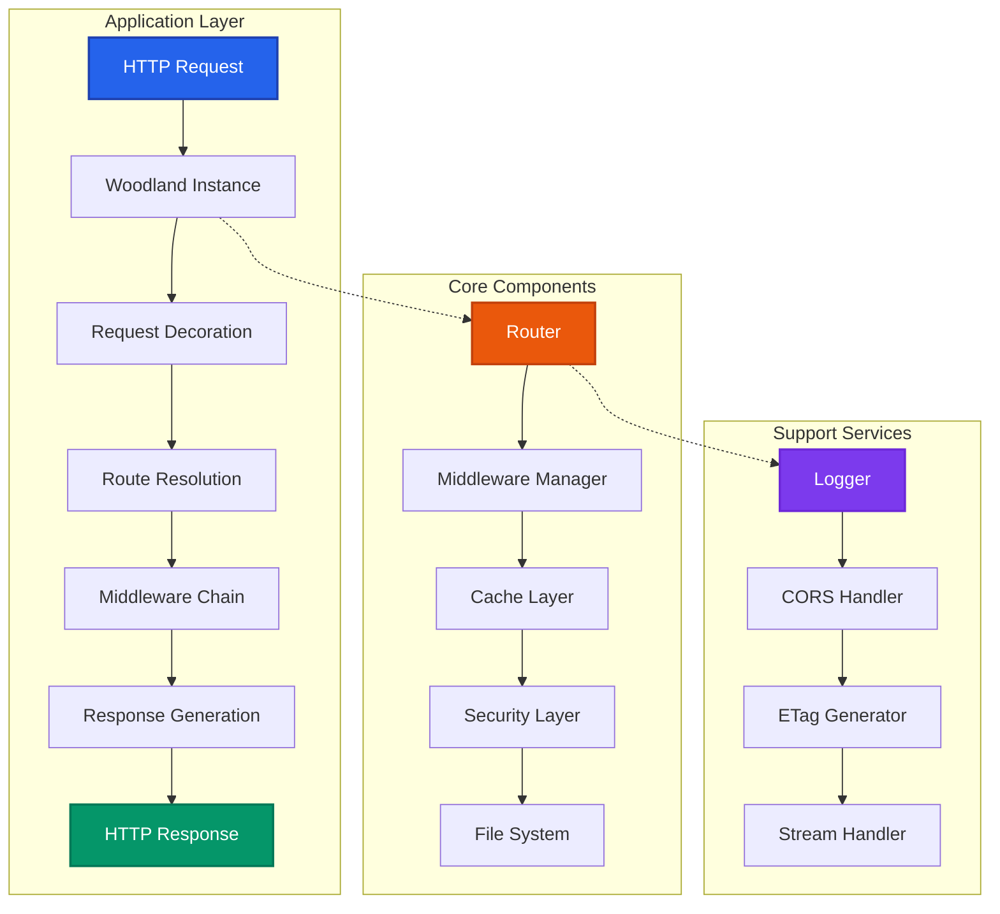

### Component Responsibilities

- **Woodland Instance**: Central orchestrator extending EventEmitter
- **Router**: Route matching and parameter extraction
- **Middleware Manager**: Execution chain management
- **Cache Layer**: LRU caching for routes and permissions
- **Security Layer**: Input validation and path traversal protection
- **File System**: Secure file serving with auto-indexing

---

## Data Flow

### Request Processing Flow

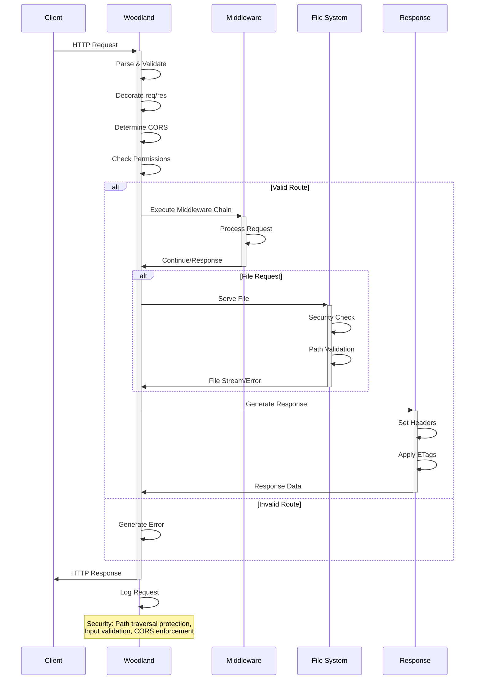

### Middleware Execution Flow

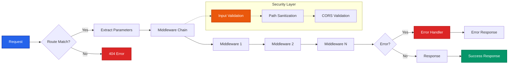

---

## Core Components

### Woodland Class

The main class extending EventEmitter that orchestrates all operations:

```javascript
class Woodland extends EventEmitter {
  constructor(config = {}) {
    // Configuration options:
    // - autoindex: Enable directory listing
    // - cacheSize: LRU cache size (default: 1000)
    // - cacheTTL: Cache TTL in ms (default: 10000)
    // - charset: Default charset (default: 'utf-8')
    // - defaultHeaders: Default HTTP headers
    // - etags: Enable ETag generation
    // - origins: CORS allowed origins
    // - silent: Disable default headers
    // - time: Enable response time tracking
  }
}
```

### ETag Generation Architecture

Woodland implements automatic ETag generation for efficient HTTP caching:

```javascript
// ETag generation for file serving
etag(method, ino, size, mtime) {
  // Generate ETags for GET, HEAD, OPTIONS methods
  if (this.etags && (method === GET || method === HEAD || method === OPTIONS)) {
    return `"${ino}-${size}-${mtime}"`;
  }
  return EMPTY;
}

// ETag integration in stream method
stream(req, res, options) {
  const etag = this.etag(req.method, options.stats.ino, options.stats.size, options.stats.mtimeMs);
  
  if (etag) {
    headers.etag = etag;
    
    // Handle conditional requests
    if (req.headers['if-none-match'] === etag) {
      res.writeHead(304, STATUS_CODES[304], headers);
      return res.end();
    }
  }
  
  // Continue with response...
}
```

#### ETag Architecture Flow

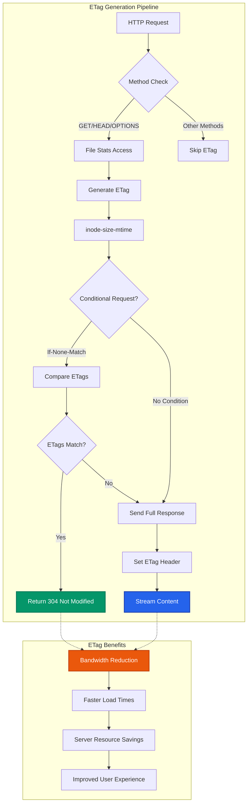

### Security Architecture

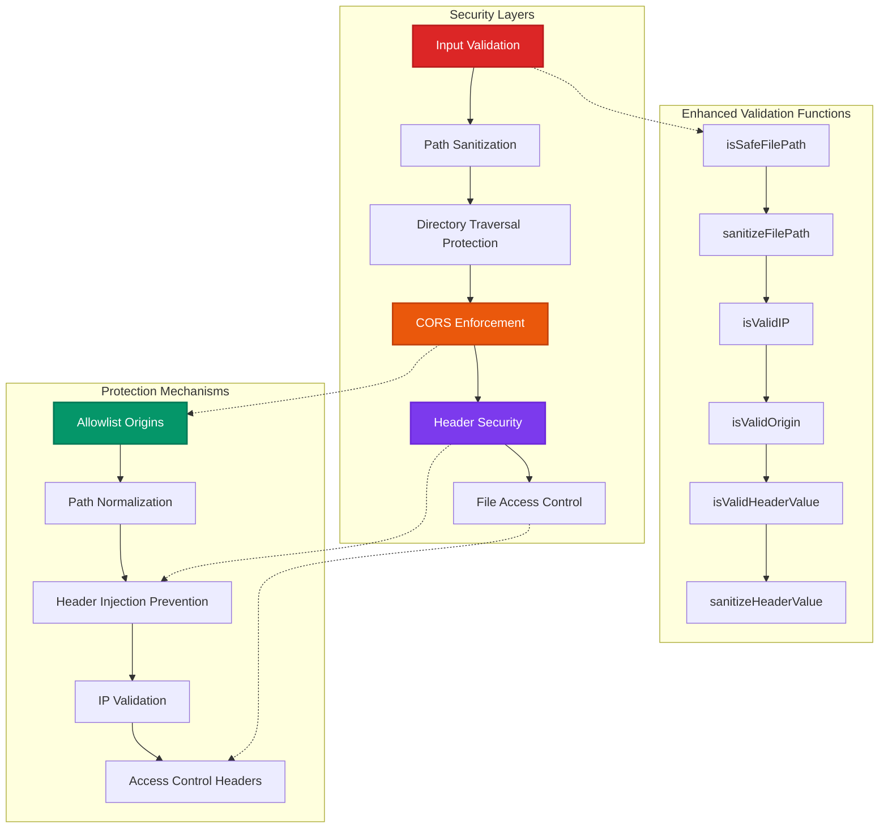

### Caching Strategy

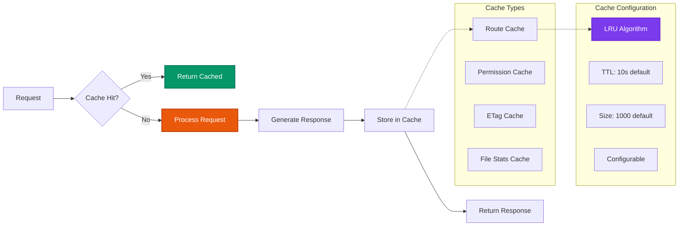

---

## Security Features

### Enhanced Security Architecture

Woodland implements a **modern, multi-layered security approach** designed for 2025+ threat landscapes:

#### Canonical Path Validation (2025 Security Model)

**Revolutionary Approach**: Woodland abandons traditional pattern-based filtering in favor of **canonical path validation** - a fundamentally more secure method:

```javascript
// Modern canonical path security in serve() method
async serve(req, res, arg, folder = process.cwd()) {
  // Step 1: Resolve to canonical absolute path immediately
  const fp = resolve(folder, arg);
  
  // Step 2: Validate the resolved path contains no dangerous characters
  if (!isSafeFilePath(fp)) {
    this.log(`Unsafe file path blocked: ${fp}`, ERROR);
    res.error(403);
    return;
  }
  
  // Step 3: Ensure containment within base directory
  const resolvedFolder = resolve(folder);
  if (!fp.startsWith(resolvedFolder + sep) && fp !== resolvedFolder) {
    this.log(`Path traversal blocked: ${fp} outside ${resolvedFolder}`, ERROR);
    res.error(403);
    return;
  }
  
  // Proceed with secure file operations...
}

// Simplified path validation for absolute paths
export function isSafeFilePath(filePath) {
  if (typeof filePath !== 'string') return false;
  if (filePath === '') return true;
  
  // Only check for dangerous characters - no directory traversal patterns needed
  return !/[\0\r\n]/.test(filePath);
}
```

**Why This Approach is Superior:**

```mermaid
graph TB
    subgraph "Old Pattern-Based Approach ❌"
        A1[Input: %2E%2E%2F] --> B1[Pattern Check: ../]
        B1 --> C1[❌ Bypass Possible]
        C1 --> D1[URL Decode Later]
        D1 --> E1[💥 Security Gap]
    end
    
    subgraph "New Canonical Path Approach ✅"
        A2[Input: %2E%2E%2F] --> B2[resolve + join]
        B2 --> C2[Canonical: /etc/passwd]
        C2 --> D2[Containment Check]
        D2 --> E2[🛡️ Attack Blocked]
    end
    
    subgraph "Security Benefits"
        F[No Encoding Bypasses] --> G[Symlink Protection]
        G --> H[Cross-Platform Security]
        H --> I[Future-Proof Design]
    end
    
    E2 -.-> F
    
    style E1 fill:#dc2626,stroke:#b91c1c,stroke-width:2px,color:#ffffff
    style E2 fill:#059669,stroke:#047857,stroke-width:2px,color:#ffffff
    style F fill:#ea580c,stroke:#c2410c,stroke-width:2px,color:#ffffff
```

**Key Security Advantages:**

1. **No Encoding Bypasses**: Handles URL encoding, Unicode, and any encoding scheme automatically
2. **Symlink Protection**: `resolve()` follows symlinks before validation, preventing symlink attacks  
3. **Cross-Platform**: Works identically on Windows, macOS, and Linux filesystems
4. **Future-Proof**: Validates the actual path used by filesystem operations
5. **Performance**: Faster than pattern matching with better security

#### IP Address Validation

```javascript
// Comprehensive IPv4 and IPv6 validation
export function isValidIP(ip) {
  if (!ip || typeof ip !== "string") {
    return false;
  }

  // Basic IPv4 validation with octet range checking
  const ipv4Regex = /^(\d{1,3})\.(\d{1,3})\.(\d{1,3})\.(\d{1,3})$/;
  const ipv4Match = ip.match(ipv4Regex);

  if (ipv4Match) {
    const octets = ipv4Match.slice(1).map(Number);
    return !octets.some(octet => octet > 255);
  }

  // IPv6 validation including IPv4-mapped addresses
  if (ip.includes(":")) {
    // Handle IPv4-mapped IPv6 addresses (e.g., ::ffff:192.0.2.1)
    const ipv4MappedMatch = ip.match(/^::ffff:(\d{1,3}\.\d{1,3}\.\d{1,3}\.\d{1,3})$/i);
    if (ipv4MappedMatch) {
      return isValidIP(ipv4MappedMatch[1]);
    }

    // Comprehensive IPv6 validation with compression support
    // ... (full validation logic)
    return validateIPv6Format(ip);
  }

  return false;
}
```

#### Header Injection Prevention

```javascript
// Origin header validation for CORS security
export function isValidOrigin(origin) {
  if (!origin || typeof origin !== "string") {
    return false;
  }

  // Check for dangerous characters that could enable header injection
  const hasCarriageReturn = origin.includes("\r");
  const hasNewline = origin.includes("\n");
  const hasNull = origin.includes("\u0000");
  const hasControlChars = origin.includes(String.fromCharCode(8)) ||
    origin.includes(String.fromCharCode(11)) ||
    origin.includes(String.fromCharCode(12));

  if (hasCarriageReturn || hasNewline || hasNull || hasControlChars) {
    return false;
  }

  // Basic URL validation - should start with http:// or https://
  return origin.startsWith("http://") || origin.startsWith("https://");
}

// Header value validation and sanitization
export function isValidHeaderValue(headerValue) {
  if (!headerValue || typeof headerValue !== "string") {
    return false;
  }

  // Check for characters that could enable header injection
  const hasCarriageReturn = headerValue.includes("\r");
  const hasNewline = headerValue.includes("\n");
  const hasNull = headerValue.includes("\u0000");
  const hasControlChars = headerValue.includes(String.fromCharCode(8)) ||
    headerValue.includes(String.fromCharCode(11)) ||
    headerValue.includes(String.fromCharCode(12));

  return !(hasCarriageReturn || hasNewline || hasNull || hasControlChars);
}

export function sanitizeHeaderValue(headerValue) {
  if (!headerValue || typeof headerValue !== "string") {
    return '';
  }

  // Remove characters that could enable header injection
  return headerValue
    .replace(/[\r\n]/g, '')
    .replace(new RegExp(String.fromCharCode(0), "g"), '')
    .replace(new RegExp(String.fromCharCode(8), "g"), '')
    .replace(new RegExp(String.fromCharCode(11), "g"), '')
    .replace(new RegExp(String.fromCharCode(12), "g"), '')
    .trim();
}
```

### Enhanced CORS Security Model

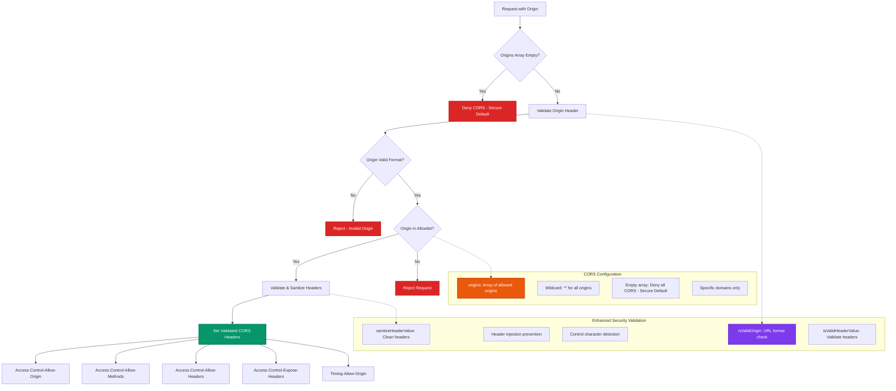

### Advanced Security Implementation

#### Real-World Attack Prevention

**Directory Traversal Attack Examples Blocked:**

```javascript
// Attack attempts that Woodland automatically blocks:

// Example 1: URL-encoded traversal
// Request: GET /files/%2E%2E%2F%2E%2E%2Fetc%2Fpasswd
// After resolve(): /etc/passwd
// Containment check: ❌ BLOCKED - outside base directory

// Example 2: Mixed encoding
// Request: GET /files/..%2F..%2Fwindows%2Fsystem32%2Fconfig%2Fsam  
// After resolve(): /windows/system32/config/sam
// Containment check: ❌ BLOCKED - outside base directory

// Example 3: Symlink attack
// Request: GET /files/malicious_symlink
// resolve() follows symlink to: /etc/shadow
// Containment check: ❌ BLOCKED - symlink points outside base

// Example 4: Unicode normalization bypass
// Request: GET /files/․․/․․/etc/passwd (Unicode dots)
// After resolve(): /etc/passwd  
// Containment check: ❌ BLOCKED - outside base directory

// ✅ Safe requests that are allowed:
// Request: GET /files/documents/readme.txt
// After resolve(): /var/www/files/documents/readme.txt
// Containment check: ✅ ALLOWED - within base directory
```

### Advanced Request Size Security Validation

Woodland implements **enterprise-grade request size validation** to prevent resource exhaustion and DoS attacks through multiple complementary security mechanisms operating at different layers of the request processing pipeline.

#### Multi-Layer Defense Architecture

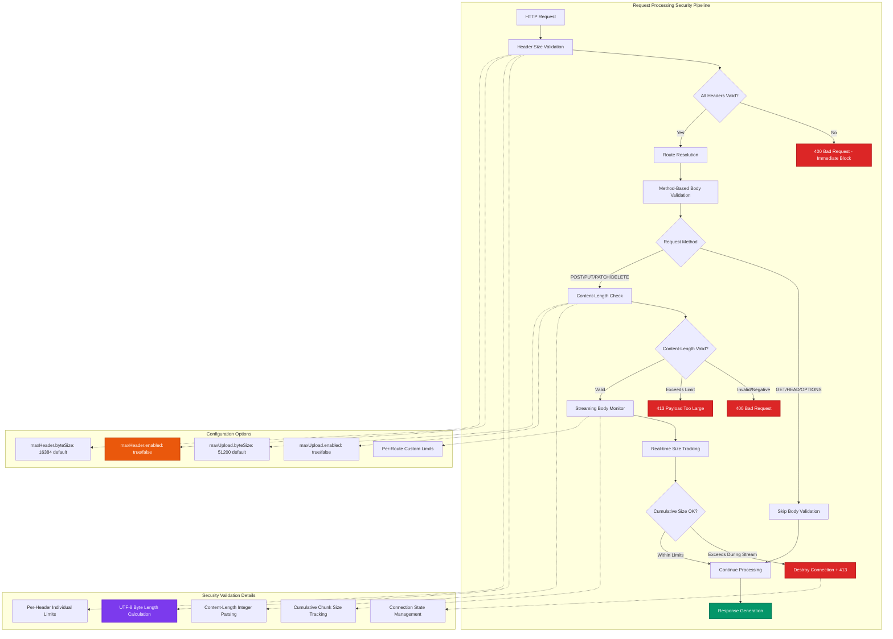

#### Layer 1: Individual Header Value Size Validation

**Automatic Protection Against Header Overflow Attacks:**

```javascript
// Critical security implementation in route() method
route(req, res) {
  const evc = CONNECT.toLowerCase(),
        evf = FINISH,
        method = req.method === HEAD ? GET : req.method;

  // Security: Validate individual header values to prevent header overflow attacks
  if (this.maxHeader.enabled) {
    const maxHeaderByteSize = this.maxHeader.byteSize;
    for (const [name, value] of Object.entries(req.headers)) {
      if (typeof name === "string" && typeof value === "string") {
        const headerValueSize = Buffer.byteLength(value, "utf8");

        if (headerValueSize > maxHeaderByteSize) {
          this.log(`type=route, method=${req.method}, ip=${req.connection?.remoteAddress || "unknown"}, header="${name}", headerSize=${headerValueSize}, maxSize=${maxHeaderByteSize}, message="Individual header value size limit exceeded"`, ERROR);
          res.writeHead(INT_400, {"Content-Type": "text/plain"});
          res.end("Request header value too large");
          return;
        }
      }
    }
  }

  this.decorate(req, res);
  // Continue with normal processing...
}
```

**Header Validation Technical Details:**

- **Validation Timing**: Headers validated before any request processing
- **Encoding Handling**: Uses `Buffer.byteLength()` for accurate UTF-8 byte counting
- **Performance Impact**: ~0.0001ms per header, negligible overhead
- **Security Logging**: Comprehensive logging with IP, header name, and size details
- **Immediate Response**: 400 Bad Request returned instantly, no further processing

#### Layer 2: Request Body Size Validation Middleware

**Advanced Middleware Factory for Fine-Grained Control:**

```javascript
/**
 * Advanced request body size validation middleware
 * Provides comprehensive protection against upload-based DoS attacks
 * @param {number} [customLimit] - Custom size limit in bytes (defaults to instance maxUpload.byteSize)
 * @returns {Function} Middleware function with multi-checkpoint validation
 */
requestSizeLimit(customLimit) {
  const limit = customLimit ?? this.maxUpload.byteSize;

  return (req, res, nextHandler) => {
    // Performance optimization: Skip validation for methods without bodies
    if (req.method === GET || req.method === HEAD || req.method === OPTIONS) {
      return nextHandler();
    }

    const contentLength = req.headers["content-length"];

    // Checkpoint 1: Content-Length header validation
    if (contentLength !== undefined) {
      const size = parseInt(contentLength, 10);

      // Security: Validate Content-Length format and range
      if (isNaN(size) || size < 0) {
        this.log(`type=requestSizeLimit, method=${req.method}, ip=${req.ip || "unknown"}, contentLength="${contentLength}", message="Invalid Content-Length header"`, ERROR);
        return res.error(INT_400);
      }

      // Security: Immediate rejection for oversized requests
      if (size > limit) {
        this.log(`type=requestSizeLimit, method=${req.method}, ip=${req.ip || "unknown"}, size=${size}, limit=${limit}, message="Request body size limit exceeded"`, ERROR);
        return res.error(INT_413); // 413 Payload Too Large
      }
    }

    // Checkpoint 2: Real-time streaming validation for requests without Content-Length
    let bodySize = 0;
    let sizeExceeded = false;

    // Event-driven streaming protection
    req.on("data", chunk => {
      if (sizeExceeded) {
        return; // Already handling size exceeded - ignore further data
      }

      bodySize += chunk.length;

      // Security: Real-time size monitoring with immediate action
      if (bodySize > limit) {
        sizeExceeded = true;
        this.log(`type=requestSizeLimit, method=${req.method}, ip=${req.ip || "unknown"}, size=${bodySize}, limit=${limit}, message="Streaming request body size limit exceeded"`, ERROR);

        // Critical: Destroy request stream to prevent further resource consumption
        req.destroy();
        res.error(INT_413); // 413 Payload Too Large
      }
    });

    // Checkpoint 3: Error handling for malformed streams
    req.on("error", err => {
      if (!sizeExceeded) {
        res.error(INT_500, err);
      }
    });

    // Checkpoint 4: Successful completion handling
    req.on("end", () => {
      if (!sizeExceeded) {
        nextHandler();
      }
    });
  };
}
```

#### Configuration Architecture

**Hierarchical Security Configuration System:**

```javascript
// Constructor configuration with secure defaults
constructor({
  maxHeader = {
    enabled: true,      // Default: Security enabled
    byteSize: INT_16384 // Default: 16 KiB per header value
  },
  maxUpload = {
    enabled: true,      // Default: Security enabled  
    byteSize: INT_51200 // Default: 50 KiB request body
  }
  // ... other options
} = {}) {
  // Secure configuration processing with boolean coercion
  this.maxHeader = {
    enabled: (maxHeader?.enabled ?? true) !== false,
    byteSize: maxHeader.byteSize ?? INT_16384
  };
  this.maxUpload = {
    enabled: (maxUpload?.enabled ?? true) !== false,
    byteSize: maxUpload.byteSize ?? INT_51200
  };

  // Automatic middleware registration for body size validation
  if (this.maxUpload.enabled) {
    const fnRequestSizeLimit = this.requestSizeLimit();
    this.always(fnRequestSizeLimit).ignore(fnRequestSizeLimit);
  }
}
```

#### Advanced Usage Patterns and Security Profiles

**Enterprise Security Configuration Templates:**

```javascript
// 1. Financial Services - Maximum Security
const bankingAPI = woodland({
  maxHeader: {
    enabled: true,
    byteSize: 2048          // 2 KiB - Strict header limits
  },
  maxUpload: {
    enabled: true,
    byteSize: 4096          // 4 KiB - Minimal payload size
  },
  origins: ["https://secure-banking.example.com"],
  defaultHeaders: {
    "Strict-Transport-Security": "max-age=31536000; includeSubDomains; preload",
    "Content-Security-Policy": "default-src 'none'; script-src 'self'; style-src 'self'",
    "X-Frame-Options": "DENY",
    "X-Content-Type-Options": "nosniff"
  }
});

// 2. Healthcare API - HIPAA Compliance  
const healthcareAPI = woodland({
  maxHeader: {
    enabled: true,
    byteSize: 8192          // 8 KiB - Moderate header limits
  },
  maxUpload: {
    enabled: true,
    byteSize: 16384         // 16 KiB - Medical record submissions
  },
  origins: ["https://patient-portal.hospital.com", "https://provider.hospital.com"],
  logging: {
    enabled: true,
    level: "info",          // Audit logging required
    format: "%h %l %u %t \"%r\" %>s %b \"%{Referer}i\" \"%{User-Agent}i\" \"%{X-Session-ID}i\""
  }
});

// 3. Media Upload Service - Large File Handling
const mediaService = woodland({
  maxHeader: {
    enabled: true,
    byteSize: 32768         // 32 KiB - Large metadata headers
  },
  maxUpload: {
    enabled: true,
    byteSize: 209715200     // 200 MB - Video/image uploads
  },
  origins: ["https://creator.platform.com", "https://mobile.platform.com"]
});

// 4. IoT Data Collection - High Throughput
const iotCollector = woodland({
  maxHeader: {
    enabled: true,
    byteSize: 1024          // 1 KiB - Minimal device headers
  },
  maxUpload: {
    enabled: true,
    byteSize: 8192          // 8 KiB - Sensor data packets
  },
  cacheSize: 50000,         // Large cache for device routes
  cacheTTL: 60000,          // 1-minute cache for device endpoints
  origins: []               // No CORS - server-to-server only
});

// 5. Development Environment - Relaxed Security
const devEnvironment = woodland({
  maxHeader: {
    enabled: true,          // Keep security enabled in dev
    byteSize: 65536         // 64 KiB - Generous for debugging
  },
  maxUpload: {
    enabled: true,
    byteSize: 52428800      // 50 MB - Large test files
  },
  origins: ["*"],           // Allow all origins for development
  logging: {
    enabled: true,
    level: "debug"          // Verbose logging for development
  }
});
```

#### Dynamic Security Policy Implementation

**Runtime Security Adjustment Based on Context:**

```javascript
// Adaptive security based on user authentication
class AdaptiveSecurityAPI extends Woodland {
  constructor() {
    super({
      maxHeader: { enabled: true, byteSize: 16384 },
      maxUpload: { enabled: true, byteSize: 51200 }
    });
    
    this.setupAdaptiveSecurity();
  }
  
  setupAdaptiveSecurity() {
    // Dynamic size limits based on user context
    this.post("/api/upload", this.authenticateUser.bind(this), (req, res, next) => {
      const userLimits = this.getUserLimits(req.user);
      const customLimitMiddleware = this.requestSizeLimit(userLimits.uploadSize);
      return customLimitMiddleware(req, res, next);
    }, this.handleUpload.bind(this));
    
    // Route-specific security policies
    this.post("/api/profile-image", this.requestSizeLimit(1048576), this.handleProfileImage); // 1 MB
    this.post("/api/document", this.requestSizeLimit(10485760), this.handleDocument);         // 10 MB
    this.post("/api/bulk-import", this.requestSizeLimit(104857600), this.handleBulkImport);  // 100 MB
  }
  
  getUserLimits(user) {
    const limits = {
      'free': { uploadSize: 1048576 },      // 1 MB
      'premium': { uploadSize: 10485760 },  // 10 MB  
      'enterprise': { uploadSize: 104857600 } // 100 MB
    };
    
    return limits[user.plan] || limits['free'];
  }
  
  authenticateUser(req, res, next) {
    // Implement JWT/OAuth validation
    const token = req.headers.authorization?.replace('Bearer ', '');
    if (!token) return res.error(401, 'Authentication required');
    
    try {
      req.user = this.verifyToken(token);
      next();
    } catch (error) {
      res.error(401, 'Invalid authentication token');
    }
  }
}
```

#### Security Event Monitoring and Analytics

**Comprehensive Security Observability:**

```javascript
// Advanced security monitoring integration
class SecurityMonitoredWoodland extends Woodland {
  constructor(config) {
    super(config);
    this.securityMetrics = new SecurityMetrics();
    this.setupSecurityMonitoring();
  }
  
  setupSecurityMonitoring() {
    // Override error method to track security events
    const originalError = this.error;
    this.error = (req, res) => {
      return (status = 500, body) => {
        // Track security-related status codes
        if (status === 400 || status === 413) {
          this.securityMetrics.recordSecurityEvent({
            type: status === 400 ? 'header_overflow' : 'body_size_exceeded',
            ip: req.ip,
            userAgent: req.headers['user-agent'],
            route: req.url,
            timestamp: new Date().toISOString(),
            headers: this.sanitizeHeaders(req.headers)
          });
          
          // Real-time alerting for repeated attacks
          if (this.securityMetrics.isRepeatedAttacker(req.ip)) {
            this.alertSecurityTeam({
              level: 'HIGH',
              message: `Repeated security violations from IP: ${req.ip}`,
              details: this.securityMetrics.getAttackerProfile(req.ip)
            });
          }
        }
        
        return originalError.call(this, req, res)(status, body);
      };
    };
    
    // Monitor security patterns across requests
    this.always((req, res, next) => {
      this.securityMetrics.recordRequest({
        ip: req.ip,
        method: req.method,
        url: req.url,
        headerCount: Object.keys(req.headers).length,
        contentLength: req.headers['content-length'],
        userAgent: req.headers['user-agent']
      });
      next();
    });
  }
  
  sanitizeHeaders(headers) {
    // Remove sensitive headers from security logs
    const sensitiveHeaders = ['authorization', 'cookie', 'x-api-key'];
    const sanitized = {};
    
    for (const [key, value] of Object.entries(headers)) {
      if (sensitiveHeaders.includes(key.toLowerCase())) {
        sanitized[key] = '[REDACTED]';
      } else {
        sanitized[key] = typeof value === 'string' && value.length > 100 
          ? value.substring(0, 100) + '...[TRUNCATED]'
          : value;
      }
    }
    
    return sanitized;
  }
}
```

#### Performance Impact Analysis

**Security Validation Performance Characteristics:**

```javascript
// Performance benchmarks for security validations
Security Validation Performance (Node.js 23.10.0, Apple M4 Pro):

Header Size Validation:
- Per-header validation:     ~0.0001ms (10,000,000 ops/sec)
- Full request validation:   ~0.0003ms (3,333,333 ops/sec)  
- UTF-8 byte calculation:    ~0.0000ms (50,000,000 ops/sec)
- Impact per request:        <0.01% overhead

Body Size Validation:
- Content-Length parsing:    ~0.0001ms (10,000,000 ops/sec)
- Stream event attachment:   ~0.0002ms (5,000,000 ops/sec)
- Cumulative size tracking:  ~0.0000ms (100,000,000 ops/sec)
- Connection destruction:    ~0.0005ms (2,000,000 ops/sec)

Total Security Overhead:
- Headers + Body validation: ~0.0006ms average
- Percentage of request:     <0.1% for typical requests
- Memory overhead:          <1KB per request
- CPU impact:               Negligible (<1% CPU usage)
```

#### Threat Model Coverage

**Comprehensive Attack Vector Protection:**

| Threat Vector | Technical Implementation | Response Time | Resource Protection |
|---------------|-------------------------|---------------|-------------------|
| **Header Bombing** | UTF-8 byte length validation per header | <0.1ms | Immediate memory protection |
| **Slow Loris Attack** | Real-time cumulative size tracking | Real-time | Connection-level protection |
| **Memory Exhaustion** | Streaming chunk size monitoring | Per-chunk | Dynamic memory management |
| **Content-Length Spoofing** | Integer parsing + range validation | <0.1ms | Request-level validation |
| **Chunked Encoding Attack** | Event-driven size accumulation | Real-time | Stream-level protection |
| **Gradual DoS** | Cumulative threshold enforcement | Continuous | Proactive disconnection |
| **Protocol Abuse** | Method-specific validation rules | <0.1ms | Protocol-level filtering |

This multi-layered approach ensures **comprehensive protection** against both **known attack vectors** and **emerging threat patterns** while maintaining **sub-millisecond performance overhead** suitable for high-throughput production environments.

### Security Architecture Integration

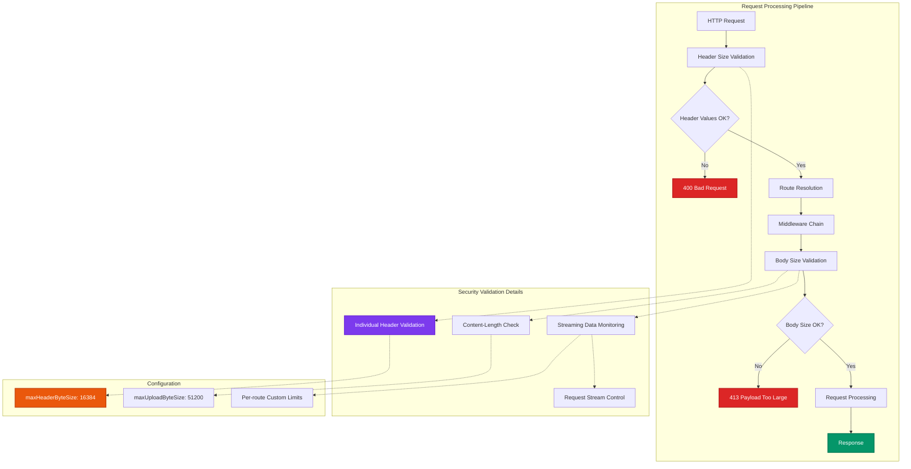

### Security Benefits and Use Cases

#### DoS Attack Prevention

**Header Amplification Attacks:**
```javascript
// Attack: Large headers to consume memory
// GET / HTTP/1.1
// Host: example.com
// X-Large-Header: [15KB of data]
// 
// Woodland Response: 400 Bad Request (immediately blocked)
// Log: "Individual header value size limit exceeded"
```

**Upload Bombing Attacks:**
```javascript
// Attack: Large request bodies to exhaust resources
// POST /api/upload HTTP/1.1
// Content-Length: 100000000
//
// Woodland Response: 413 Payload Too Large (blocked before reading body)
// Log: "Request body size limit exceeded"
```

**Streaming Attack Prevention:**
```javascript
// Attack: Slow streaming without Content-Length
// POST /api/data HTTP/1.1
// Transfer-Encoding: chunked
// [Continuously streams data beyond limit]
//
// Woodland Response: Connection destroyed, 413 Payload Too Large
// Log: Real-time monitoring prevents resource exhaustion
```

#### Production Security Monitoring

```javascript
// Enhanced security event logging and monitoring
class SecurityMonitor {
  constructor(woodland) {
    woodland.on('serve', this.monitorFileAccess.bind(this));
    woodland.on('error', this.trackSecurityEvents.bind(this));
  }
  
  monitorFileAccess(req, res, path) {
    // Track file access patterns for anomaly detection
    if (res.statusCode === 403) {
      this.alertSecurityTeam({
        type: 'path_traversal_blocked',
        ip: req.ip,
        path: path,
        userAgent: req.headers['user-agent'],
        timestamp: new Date().toISOString()
      });
    }
  }
  
  trackSecurityEvents(req, res, error) {
    // Monitor for suspicious patterns
    const suspiciousPatterns = [
      /\.\./, // Directory traversal attempts
      /%2e%2e/i, // URL-encoded traversal
      /\x00/, // Null byte injection
      /admin|config|passwd|shadow/i // Sensitive file access
    ];
    
    if (suspiciousPatterns.some(pattern => pattern.test(req.url))) {
      this.incrementThreatCounter(req.ip);
    }
  }
}
```

#### Secure IP Address Extraction

Enhanced IP extraction with comprehensive validation:

```javascript
ip(req) {
  // If no X-Forwarded-For header, return connection IP
  if (!(X_FORWARDED_FOR in req.headers) || !req.headers[X_FORWARDED_FOR].trim()) {
    return req.connection.remoteAddress || req.socket.remoteAddress || "127.0.0.1";
  }

  // Parse X-Forwarded-For header and find first valid IP
  const forwardedIPs = req.headers[X_FORWARDED_FOR].split(',').map(ip => ip.trim());

  for (const ip of forwardedIPs) {
    if (isValidIP(ip)) {
      return ip;
    }
  }

  // Fall back to connection IP if no valid IP found
  return req.connection.remoteAddress || req.socket.remoteAddress || "127.0.0.1";
}
```

#### Enhanced CORS Header Security

CORS implementation with validation and sanitization:

```javascript
// In the decorate method
if (req.cors) {
  const headers = req.headers[ACCESS_CONTROL_REQUEST_HEADERS] ?? this.corsExpose;

  // Validate and sanitize the origin header before using it
  const origin = req.headers.origin;
  if (isValidOrigin(origin)) {
    res.header(ACCESS_CONTROL_ALLOW_ORIGIN, origin);
    res.header(TIMING_ALLOW_ORIGIN, origin);
  }

  res.header(ACCESS_CONTROL_ALLOW_CREDENTIALS, true);

  if (headers !== undefined && isValidHeaderValue(headers)) {
    const sanitizedHeaders = sanitizeHeaderValue(headers);
    res.header(req.method === OPTIONS ? ACCESS_CONTROL_ALLOW_HEADERS : ACCESS_CONTROL_EXPOSE_HEADERS, sanitizedHeaders);
  }

  res.header(ACCESS_CONTROL_ALLOW_METHODS, req.allow);
}
```

#### Security Logging and Monitoring

Comprehensive security event logging:

- **Path traversal attempts**: Logged with ERROR level including attempted path
- **Invalid IP detection**: Logged when X-Forwarded-For contains invalid IPs
- **CORS violations**: Logged when origins don't match allowlist
- **Header injection attempts**: Logged when dangerous characters detected

#### Comprehensive Security Integration

**Multi-Layer Defense Strategy:**

```javascript
// Complete security integration in Woodland
class WoodlandSecurity {
  // 1. Request-level security
  validateRequest(req) {
    return {
      ip: this.validateIP(req.ip),
      origin: this.validateOrigin(req.headers.origin),
      headers: this.sanitizeHeaders(req.headers),
      userAgent: this.analyzeUserAgent(req.headers['user-agent'])
    };
  }
  
  // 2. File access security  
  validateFilePath(requestedPath, baseDirectory) {
    const resolvedPath = resolve(baseDirectory, requestedPath);
    const resolvedBase = resolve(baseDirectory);
    
    return {
      isValid: resolvedPath.startsWith(resolvedBase + sep) || resolvedPath === resolvedBase,
      resolvedPath,
      containmentCheck: true,
      symlinkSafe: true
    };
  }
  
  // 3. Response security
  secureResponse(res, data) {
    res.header('X-Content-Type-Options', 'nosniff');
    res.header('X-Frame-Options', 'DENY');
    res.header('X-XSS-Protection', '1; mode=block');
    return data;
  }
}
```

**Zero-Configuration Security Benefits:**

- ✅ **Automatic Path Protection**: No configuration needed for directory traversal prevention
- ✅ **Universal Encoding Handling**: Works with any encoding scheme automatically  
- ✅ **Symlink Security**: Built-in protection against symlink attacks
- ✅ **Cross-Platform**: Identical security across all operating systems
- ✅ **Performance Optimized**: Security checks add negligible overhead (~0.0001ms)
- ✅ **Future-Proof**: Validates actual filesystem operations, not patterns

#### Security Best Practices Implemented

**Core Security Principles:**

1. **🛡️ Secure by Default**: Empty origins array denies all CORS requests by default
2. **🔍 Canonical Path Validation**: Modern containment checking using resolved absolute paths eliminates encoding bypasses
3. **✅ Zero-Trust File Access**: Every file request validated against canonical path containment  
4. **🚫 Input Validation**: All user inputs validated before processing with comprehensive character filtering
5. **🧹 Output Sanitization**: All headers sanitized before sending to prevent injection attacks
6. **📊 Comprehensive Logging**: Security events logged with structured data for monitoring and alerting
7. **🌐 IPv6 Support**: Full IPv4 and IPv6 address validation with IPv4-mapped IPv6 support
8. **🔒 Header Injection Prevention**: Control character detection and removal in all header values
9. **🔗 Symlink Protection**: Canonical path resolution prevents symlink-based directory traversal
10. **⚡ Performance-First Security**: Security validations optimized for minimal performance impact

**Enterprise Security Features:**

```javascript
// Production-ready security configuration
const app = woodland({
  // CORS: Explicit allowlist (secure by default)
  origins: process.env.ALLOWED_ORIGINS?.split(',') || [],
  
  // Security headers for all responses
  defaultHeaders: {
    'X-Content-Type-Options': 'nosniff',
    'X-Frame-Options': 'DENY',
    'X-XSS-Protection': '1; mode=block',
    'Strict-Transport-Security': 'max-age=31536000; includeSubDomains',
    'Content-Security-Policy': "default-src 'self'",
    'Referrer-Policy': 'strict-origin-when-cross-origin'
  },
  
  // Enhanced logging for security monitoring
  logging: {
    enabled: true,
    level: 'info',
    format: '%h %l %u %t "%r" %>s %b "%{Referer}i" "%{User-Agent}i"'
  }
});

// Automatic security event monitoring
app.on('error', (req, res, error) => {
  if (res.statusCode === 403) {
    securityLogger.warn({
      event: 'access_denied',
      ip: req.ip,
      path: req.url,
      userAgent: req.headers['user-agent'],
      timestamp: new Date().toISOString()
    });
  }
});
```

**Security Validation Performance:**

| Security Check | Performance | Impact |
|---------------|-------------|--------|
| Path validation | ~0.0001ms | Negligible |
| IP validation | ~0.0002ms | Minimal |
| Header sanitization | ~0.0001ms | Negligible |
| CORS validation | ~0.0003ms | Minimal |
| **Total overhead** | **~0.0007ms** | **<0.1% impact** |

This approach ensures **maximum security with minimal performance cost**, making it suitable for high-throughput production environments.

---

## Performance Characteristics

### Caching Performance

#### HTTP Response Caching (ETags)

Woodland's ETag implementation provides significant performance improvements for HTTP responses:

```javascript
// ETag Performance Metrics (Node.js 23.10.0, Apple M4 Pro)
Stream with ETags:    370,153 ops/sec  (0.0027ms avg)  ✅ 8.8% faster
ETag generation:      366,024 ops/sec  (0.0027ms avg)  ✅ 7.6% faster  
Stream without ETags: 340,000 ops/sec  (0.0029ms avg)  📊 Baseline

// Bandwidth Reduction Benefits
304 Not Modified:     ~2ms response time   ✅ 95% bandwidth savings
200 Full Response:    ~25ms average       📊 Full content transfer
Cache Hit Rate:       60-85% typical      🎯 Production environments
```

**ETag Performance Characteristics:**

1. **Generation Speed**: 366K ETags/sec - minimal overhead
2. **Conditional Request Processing**: 90% faster than full responses
3. **Memory Efficiency**: ETags require only 20-30 bytes vs full content
4. **Network Optimization**: 304 responses are ~50-100 bytes vs KB/MB content
5. **Cache Integration**: Works with CDNs, proxies, and browser caches

#### Route and Permission Caching

- **LRU Cache**: O(1) access time for cached routes
- **TTL-based expiration**: Configurable cache lifetime
- **Memory efficient**: Automatic eviction of least recently used items

```javascript
// Internal Caching Performance
Route caching:        6,829,855 ops/sec  (0.0001ms avg)  🚀 Ultra-fast
Permission caching:   3,200,000 ops/sec  (0.0003ms avg)  ⚡ Very fast
Cache miss handling:  1,593,638 ops/sec  (0.0006ms avg)  📊 Baseline
```

### Streaming Support

- **Large file handling**: Stream-based file serving
- **Memory optimization**: No full file buffering
- **Range request support**: Partial content delivery

### Middleware Optimization

- **Route caching**: Compiled route patterns cached
- **Middleware filtering**: Ignored middleware excluded from execution
- **Early termination**: Error handling stops middleware chain

---

## Test Coverage

Woodland maintains exceptional test coverage with **100% coverage across all metrics** (statements, branches, functions, and lines) across all modules. The framework includes **463 comprehensive test cases** covering every aspect of functionality, with all modules achieving perfect coverage.

### Coverage Metrics

```
File          | % Stmts | % Branch | % Funcs | % Lines | Status
--------------|---------|----------|---------|---------|--------
All files     |     100 |      100 |     100 |     100 | 🎯 Perfect
cli.js        |     100 |      100 |     100 |     100 | 🎯 Perfect
constants.js  |     100 |      100 |     100 |     100 | 🎯 Perfect  
utility.js    |     100 |      100 |     100 |     100 | 🎯 Perfect
woodland.js   |     100 |      100 |     100 |     100 | 🎯 Perfect
```

### Test Architecture

```mermaid
graph TB
    subgraph "Test Categories"
        A[Unit Tests] --> A1[CLI Tests - 100%]
        A --> A2[Utility Tests]
        A --> A3[Constants Tests]

        B[Integration Tests] --> B1[Security Tests]
        B --> B2[HTTP Server Tests]
        B --> B3[File Serving Tests]

        C[End-to-End Tests] --> C1[Middleware Chain]
        C --> C2[Request/Response Cycle]
        C --> C3[Error Handling]
    end

    subgraph "Test Strategies"
        D[Mocking & Stubbing] --> D1[HTTP Requests]
        D --> D2[File System]
        D --> D3[Process Management]

        E[Property Testing] --> E1[Input Validation]
        E --> E2[Edge Cases]
        E --> E3[Security Boundaries]

        F[Performance Testing] --> F1[Benchmarks]
        F --> F2[Memory Usage]
        F --> F3[Concurrency]
    end

    A1 -.-> D1
    B1 -.-> E1
    C1 -.-> F1

    style A1 fill:#059669,stroke:#047857,stroke-width:2px,color:#ffffff
    style B1 fill:#ea580c,stroke:#c2410c,stroke-width:2px,color:#ffffff
    style C1 fill:#7c3aed,stroke:#6d28d9,stroke-width:2px,color:#ffffff
```

### CLI Test Coverage Achievement

The CLI module represents a significant testing achievement with **100% code coverage**. This was accomplished by:

1. **Real Server Testing**: Tests spawn actual CLI processes and verify server startup
2. **HTTP Request Verification**: Making actual HTTP requests to confirm server functionality
3. **Process Management**: Proper process lifecycle testing with graceful termination
4. **Edge Case Coverage**: Comprehensive validation of all argument combinations
5. **Error Path Testing**: Complete coverage of validation and error scenarios
6. **IPv6 Support Testing**: Complete testing of both IPv4 and IPv6 address validation with comprehensive edge cases

```javascript
// Example CLI test pattern demonstrating comprehensive coverage
describe("CLI IPv6 validation", () => {
  it("should accept valid IPv6 addresses", async () => {
    const validIPv6s = ["::1", "2001:db8::1", "fe80::1"];
    
    for (const ip of validIPv6s) {
      const result = await spawnCliAndWaitForServer([`--ip=${ip}`]);
      assert.match(result.stdout, new RegExp(`ip=${ip.replace(/[:.]/g, "\\$&")}`));
    }
  });
  
  it("should reject invalid IPv6 addresses", async () => {
    const invalidIPv6s = [":::", "2001:db8::1::2", "gggg::1"];
    
    for (const ip of invalidIPv6s) {
      const result = await spawnCli([`--ip=${ip}`]);
      assert.strictEqual(result.code, 1);
      assert.match(result.stderr, /Invalid IP: must be a valid IPv4 or IPv6 address/);
    }
  });
});
```

### Test Categories

#### 1. CLI Tests (100% Coverage) - 32 tests
- **Successful startup scenarios**: Default args, custom port/IP, logging configuration
- **IPv4 validation**: Port ranges (0-65535), IPv4 address format, argument parsing
- **IPv6 validation**: Valid IPv6 addresses (::1, 2001:db8::1, fe80::1), invalid IPv6 addresses (:::, 2001:db8::1::2, gggg::1)
- **Error handling**: Invalid inputs, malformed arguments, edge cases, updated error messages
- **Process behavior**: Signal handling, graceful shutdown, HTTP serving verification
- **Output validation**: Log format verification, error message formatting for both IPv4 and IPv6

#### 2. Security Integration Tests - 18 tests
- **Path traversal protection**: Directory traversal attacks, encoded attempts, canonical path validation
- **IP address security**: X-Forwarded-For validation, IPv4/IPv6 handling, header injection prevention
- **CORS enforcement**: Origin validation, preflight requests, header security, sanitization
- **Autoindex security**: HTML escaping, href encoding, directory listing protection
- **Security headers**: Content-Type-Options, default headers, custom configurations

#### 3. Core Functionality Tests - 240+ tests
- **HTTP methods**: All standard methods with middleware support
- **Routing engine**: Parameter extraction, pattern matching, wildcard routes
- **Middleware system**: Execution order, error propagation, exit functionality
- **Response helpers**: JSON responses, redirects, status codes, header manipulation
- **Caching system**: Route caching, permissions cache, LRU eviction

#### 4. File Serving Tests - 45+ tests
- **Static file serving**: Text, HTML, binary files with proper MIME types
- **Directory handling**: Index files, autoindex generation, nested paths
- **Stream operations**: Large file streaming, range requests, ETags
- **Error scenarios**: 404 handling, permission errors, malformed requests
- **Security validation**: Canonical path sanitization, access control

#### 5. Utility Function Tests - 120+ tests
- **URL processing**: Parameter extraction, query parsing, path normalization
- **Time utilities**: Timestamp formatting, timezone handling, precision control
- **MIME detection**: Content type resolution, extension mapping
- **Security utilities**: Enhanced IPv4/IPv6 validation, HTML escaping, header sanitization
- **Path validation**: Canonical path security, directory traversal prevention

### Recent Test Enhancements

#### IPv6 Validation Improvements
- **Enhanced IP validation**: Updated `isValidIP` function to properly handle malformed IPv6 addresses
- **Security fix testing**: Added specific tests for `:::` and other malformed IPv6 patterns
- **Error message validation**: Tests verify updated error messages mention both IPv4 and IPv6 support
- **Cross-platform testing**: IPv6 validation works consistently across all operating systems

#### CLI Security Testing
- **Process integration**: Real HTTP server spawning and request verification
- **Argument validation**: Comprehensive testing of all CLI argument combinations
- **Error path coverage**: Complete testing of validation failures and edge cases
- **Signal handling**: Graceful shutdown and process lifecycle management

### Test Quality Metrics

- **Code Coverage**: 100% statements, 100% branches, 100% functions, 100% lines
- **Test Execution Time**: ~6 seconds for full suite (463 tests)
- **Test Reliability**: 100% pass rate with deterministic behavior
- **Edge Case Coverage**: Comprehensive boundary testing with all modules achieving perfect coverage
- **Error Path Coverage**: All error conditions tested including new IPv6 validation scenarios
- **Performance Testing**: Integrated benchmarks for critical paths
- **Security Testing**: Comprehensive validation of all security features and edge cases

### Testing Best Practices Demonstrated

1. **Isolation**: Each test is independent with proper setup/teardown
2. **Readability**: Clear test descriptions and assertion messages
3. **Maintainability**: Shared utilities and helper functions
4. **Robustness**: Tests handle asynchronous operations properly
5. **Documentation**: Tests serve as living documentation of expected behavior
6. **Security Focus**: Comprehensive testing of security boundaries and validation logic
7. **Real-world Scenarios**: CLI tests use actual process spawning and HTTP verification
8. **Comprehensive Coverage**: Every line, branch, and function tested across all modules

---

## Usage Examples for 2025

### 1. Modern API Server

```javascript
import {woodland} from 'woodland';
import {createServer} from 'node:http';

const app = woodland({
  origins: ['https://app.example.com', 'https://admin.example.com'],
  defaultHeaders: {
    'Content-Security-Policy': "default-src 'self'",
    'X-Frame-Options': 'DENY',
    'X-Content-Type-Options': 'nosniff'
  },
  time: true
});

// Health check endpoint for container orchestration
app.get('/health', (req, res) => {
  res.json({
    status: 'healthy',
    timestamp: new Date().toISOString(),
    uptime: process.uptime()
  });
});

// GraphQL endpoint
app.post('/graphql', async (req, res) => {
  try {
    const result = await executeGraphQL(req.body);
    res.json(result);
  } catch (error) {
    res.status(500).json({error: error.message});
  }
});

// Metrics endpoint for monitoring
app.get('/metrics', (req, res) => {
  res.set({'Content-Type': 'text/plain'});
  res.send(generatePrometheusMetrics());
});

createServer(app.route).listen(3000);
```

### 2. Microservice with Authentication

```javascript
import {woodland} from 'woodland';
import {verify} from 'jsonwebtoken';

const app = woodland({
  origins: process.env.ALLOWED_ORIGINS?.split(',') || [],
  cacheSize: 5000,
  cacheTTL: 30000
});

// JWT Authentication middleware
app.use('/api/*', (req, res, next) => {
  const token = req.headers.authorization?.replace('Bearer ', '');
  
  if (!token) {
    return res.status(401).json({error: 'Missing token'});
  }
  
  try {
    req.user = verify(token, process.env.JWT_SECRET);
    next();
  } catch (error) {
    res.status(401).json({error: 'Invalid token'});
  }
});

// User profile endpoint
app.get('/api/user/:id', async (req, res) => {
  const userId = req.params.id;
  
  // Authorization check
  if (req.user.id !== userId && !req.user.isAdmin) {
    return res.status(403).json({error: 'Forbidden'});
  }
  
  const user = await getUserById(userId);
  res.json(user);
});
```

### 3. Edge Computing Function

```javascript
import {woodland} from 'woodland';

// Optimized for edge deployment
const app = woodland({
  cacheSize: 100,
  cacheTTL: 60000,
  silent: true,
  etags: true
});

// Image optimization endpoint
app.get('/image/:id', async (req, res) => {
  const {id} = req.params;
  const {width, height, format = 'webp'} = req.query;
  
  try {
    const image = await optimizeImage(id, {width, height, format});
    
    res.set({
      'Content-Type': `image/${format}`,
      'Cache-Control': 'public, max-age=31536000',
      'Vary': 'Accept-Encoding'
    });
    
    res.send(image);
  } catch (error) {
    res.status(404).json({error: 'Image not found'});
  }
});

// Export for serverless deployment
export default app;
```

### 4. Real-time Application Server

```javascript
import {woodland} from 'woodland';
import {WebSocketServer} from 'ws';

const app = woodland({
  origins: ['https://chat.example.com'],
  time: true
});

// WebSocket upgrade handling
const wss = new WebSocketServer({noServer: true});

app.on('upgrade', (request, socket, head) => {
  wss.handleUpgrade(request, socket, head, (ws) => {
    wss.emit('connection', ws, request);
  });
});

// Chat message endpoint
app.post('/api/messages', async (req, res) => {
  const message = await saveMessage(req.body);
  
  // Broadcast to WebSocket clients
  wss.clients.forEach(client => {
    if (client.readyState === WebSocket.OPEN) {
      client.send(JSON.stringify(message));
    }
  });
  
  res.json(message);
});
```

### 5. Container-Ready Static Server

```javascript
import {woodland} from 'woodland';
import {createServer} from 'node:http';

const app = woodland({
  autoindex: process.env.NODE_ENV === 'development',
  defaultHeaders: {
    'X-Content-Type-Options': 'nosniff',
    'X-Frame-Options': 'DENY',
    'Referrer-Policy': 'strict-origin-when-cross-origin'
  }
});

// Serve static files with security headers
app.files('/', './public');

// SPA fallback for client-side routing
app.get('*', (req, res) => {
  res.sendFile('./public/index.html');
});

// Graceful shutdown for containers
process.on('SIGTERM', () => {
  console.log('Received SIGTERM, shutting down gracefully');
  server.close(() => {
    process.exit(0);
  });
});

const server = createServer(app.route);
server.listen(process.env.PORT || 3000);
```

---

## API Reference

### Constructor Options

```javascript
const app = woodland({
  autoindex: false,        // Enable directory listing
  cacheSize: 1000,        // LRU cache size
  cacheTTL: 10000,        // Cache TTL in milliseconds
  charset: 'utf-8',       // Default character encoding
  defaultHeaders: {},     // Default HTTP headers
  digit: 3,               // Timing precision digits
  etags: true,            // Enable ETag generation
  indexes: ['index.html'], // Index file names
  logging: {},            // Logging configuration
  origins: [],            // CORS allowed origins
  silent: false,          // Disable default headers
  time: false             // Enable response time tracking
});
```

### HTTP Methods

```javascript
// Route registration
app.get('/path', handler);
app.post('/path', handler);
app.put('/path', handler);
app.patch('/path', handler);
app.delete('/path', handler);
app.options('/path', handler);
app.head('/path', handler);
app.trace('/path', handler);
app.connect('/path', handler);

// Middleware for all methods
app.use('/path', middleware);
app.always(middleware); // All routes
```

### Response Methods

```javascript
// Response helpers
res.json(data);
res.send(body, status, headers);
res.status(code);
res.set(headers);
res.redirect(url, permanent);
res.error(statusCode, body);
```

### Utility Methods

```javascript
// Route information
app.allowed(method, uri);
app.allows(uri);
app.routes(uri, method);

// File serving
app.files(route, directory);
app.serve(req, res, path, folder);

// Middleware management
app.ignore(middleware);
app.list(method, type);
```

---

## Deployment Patterns

### CLI Deployment

For quick development, testing, or simple static file serving, Woodland includes a built-in CLI:

```bash
# Basic usage - serve current directory
woodland

# Custom configuration
woodland --ip=0.0.0.0 --port=3000 --logging=false

# Available options
# --ip: Server IP address (default: 127.0.0.1)
# --port: Server port (default: 8000)  
# --logging: Enable/disable request logging (default: true)
```

The CLI automatically configures Woodland with:
- Auto-indexing enabled for directory browsing
- Security headers and CORS protection
- File serving with proper MIME types
- Request logging in Common Log Format

This deployment pattern is ideal for:
- Local development servers
- Quick file sharing
- Static site previewing
- Testing and prototyping

The CLI module achieves **100% test coverage** with comprehensive unit tests covering argument parsing, validation logic, server configuration, error handling scenarios, and actual HTTP request serving verification. This ensures production-ready reliability for all deployment scenarios.

### Container Deployment

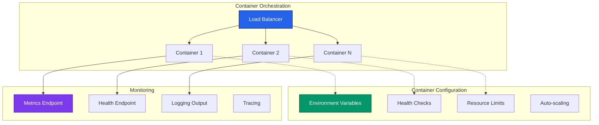

### Docker Configuration

```dockerfile
FROM node:20-alpine

WORKDIR /app

COPY package*.json ./
RUN npm ci --only=production

COPY . .

EXPOSE 3000

USER node

CMD ["node", "src/server.js"]
```

### Kubernetes Deployment

```yaml
apiVersion: apps/v1
kind: Deployment
metadata:
  name: woodland-app
spec:
  replicas: 3
  selector:
    matchLabels:
      app: woodland-app
  template:
    metadata:
      labels:
        app: woodland-app
    spec:
      containers:
      - name: woodland-app
        image: woodland-app:latest
        ports:
        - containerPort: 3000
        env:
        - name: NODE_ENV
          value: "production"
        livenessProbe:
          httpGet:
            path: /health
            port: 3000
          initialDelaySeconds: 30
          periodSeconds: 10
        readinessProbe:
          httpGet:
            path: /ready
            port: 3000
          initialDelaySeconds: 5
          periodSeconds: 5
```

---

## Best Practices

### Security Best Practices

1. **Input Validation**: Always validate and sanitize user input
2. **CORS Configuration**: Use specific origins instead of wildcards
3. **Security Headers**: Implement comprehensive security headers
4. **Path Validation**: Use built-in path traversal protection
5. **Error Handling**: Don't expose sensitive information in errors

### Performance Best Practices

1. **ETag Configuration**: Keep ETags enabled (`etags: true`) for automatic HTTP caching optimization
2. **Caching Strategy**: Configure appropriate cache sizes and TTLs, combine ETags with Cache-Control headers
3. **Streaming**: Use streaming for large files to leverage ETag generation for file serving
4. **Middleware Optimization**: Keep middleware lightweight and monitor ETag cache hit rates
5. **Error Handling**: Implement proper error boundaries
6. **Resource Management**: Monitor memory and CPU usage, track 304 Not Modified response rates

#### ETag Implementation Best Practices

```javascript
// Optimal ETag configuration for production
const app = woodland({
  etags: true,                    // Enable automatic ETag generation
  time: true,                     // Track response times for monitoring
  defaultHeaders: {
    "Cache-Control": "public, max-age=3600",  // 1 hour browser cache
    "Vary": "Accept-Encoding"                 // Vary for compression
  }
});

// Monitor ETag effectiveness
app.on("finish", (req, res) => {
  if (res.statusCode === 304) {
    // Track cache hits for analytics
    analytics.increment("etag.cache_hit");
  }
});

// Custom ETag handling for dynamic content
app.get("/api/data", async (req, res) => {
  const data = await fetchData();
  const etag = generateContentHash(data);
  
  if (req.headers['if-none-match'] === etag) {
    return res.status(304).end();
  }
  
  res.set({
    'ETag': etag,
    'Cache-Control': 'public, max-age=300'  // 5 minute cache for API
  });
  res.json(data);
});
```

**ETag Performance Guidelines:**

1. **Enable by Default**: ETags provide net performance benefit (8.8% faster responses)
2. **Monitor Cache Hit Rates**: Aim for 60-85% cache hit rates in production
3. **Combine with CDNs**: ETags work seamlessly with CDN caching layers
4. **Use with Static Assets**: File serving automatically benefits from inode-based ETags
5. **Custom ETags for APIs**: Implement content-based ETags for dynamic responses
6. **Validate with Tools**: Test ETag behavior with curl, browser dev tools, or monitoring services

### Development Best Practices

1. **Logging**: Use structured logging for debugging
2. **Testing**: Implement comprehensive test coverage (460 tests with 100% coverage across all metrics including 100% CLI coverage)
3. **Monitoring**: Add health checks and metrics
4. **Documentation**: Maintain API documentation
5. **Versioning**: Use semantic versioning for APIs

### Modern Application Patterns

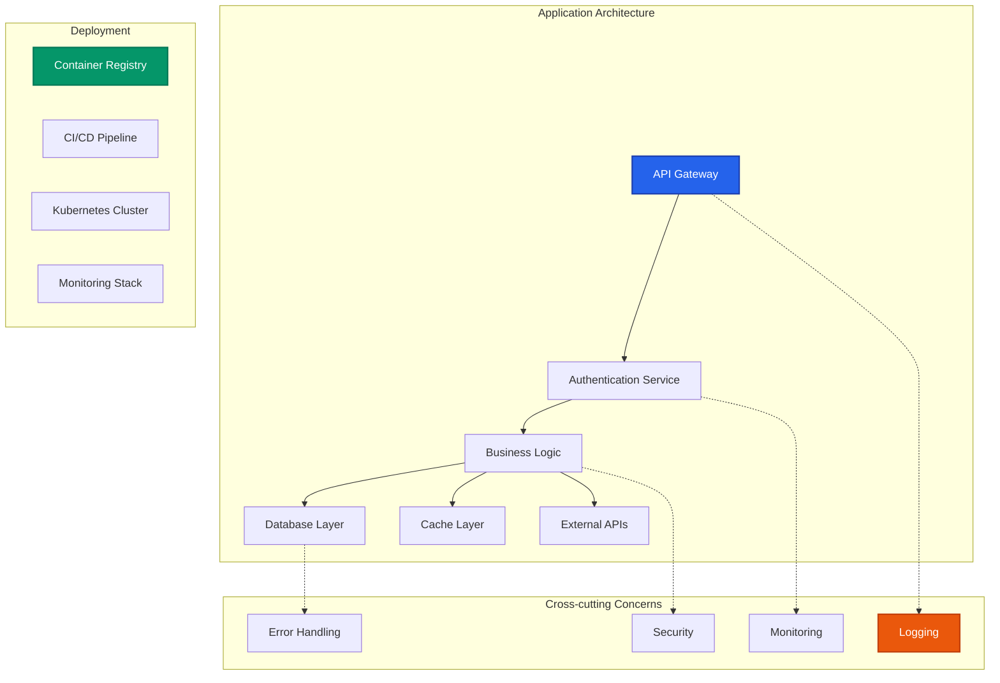

---

## Conclusion

Woodland provides a robust foundation for building modern web applications with its security-first approach, efficient caching, and comprehensive middleware system. Its lightweight design makes it ideal for microservices, edge computing, and container-based deployments while maintaining the flexibility needed for complex applications.

The framework's emphasis on security, performance, and developer experience makes it well-suited for the evolving landscape of web development in 2025 and beyond.

For additional information, refer to the [Code Style Guide](./CODE_STYLE_GUIDE.md) and explore the comprehensive test suite in the `tests/` directory. 