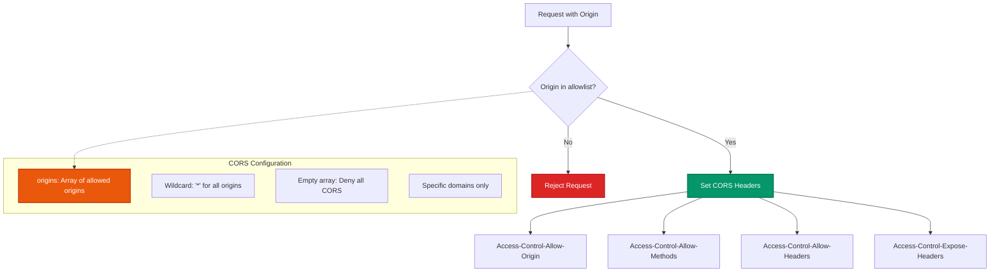

# Woodland HTTP Server Framework - Technical Documentation

## Table of Contents

1. [Overview](#overview)
2. [Architecture](#architecture)
3. [Data Flow](#data-flow)
4. [Core Components](#core-components)
5. [Security Features](#security-features)
6. [Performance Characteristics](#performance-characteristics)
7. [Usage Examples for 2025](#usage-examples-for-2025)
8. [API Reference](#api-reference)
9. [Deployment Patterns](#deployment-patterns)
10. [Best Practices](#best-practices)

---

## Overview

Woodland is a lightweight, security-focused HTTP server framework for Node.js that extends EventEmitter. It provides a middleware-based architecture with built-in features for modern web applications including CORS handling, file serving, caching, and comprehensive logging.

### Key Features

- **Middleware-based routing** with parameter extraction
- **Security-first design** with path traversal protection and input validation
- **Built-in CORS support** with configurable origins
- **ETag generation** for efficient caching
- **File serving** with auto-indexing capabilities
- **Stream support** for handling large files
- **LRU caching** for performance optimization
- **Comprehensive logging** with Common Log Format support
- **TypeScript definitions** included

### Target Use Cases

- **API servers** and microservices
- **Static file serving** with security
- **Edge computing** applications
- **Real-time** applications with EventEmitter integration
- **Container-based** deployments
- **Development servers** with auto-indexing

---

## Architecture

The Woodland framework follows a layered architecture pattern with clear separation of concerns:


### Component Responsibilities

- **Woodland Instance**: Central orchestrator extending EventEmitter
- **Router**: Route matching and parameter extraction
- **Middleware Manager**: Execution chain management
- **Cache Layer**: LRU caching for routes and permissions
- **Security Layer**: Input validation and path traversal protection
- **File System**: Secure file serving with auto-indexing

---

## Data Flow

### Request Processing Flow


### Middleware Execution Flow


---

## Core Components

### Woodland Class

The main class extending EventEmitter that orchestrates all operations:

```javascript
class Woodland extends EventEmitter {
  constructor(config = {}) {
    // Configuration options:
    // - autoindex: Enable directory listing
    // - cacheSize: LRU cache size (default: 1000)
    // - cacheTTL: Cache TTL in ms (default: 10000)
    // - charset: Default charset (default: 'utf-8')
    // - defaultHeaders: Default HTTP headers
    // - etags: Enable ETag generation
    // - origins: CORS allowed origins
    // - silent: Disable default headers
    // - time: Enable response time tracking
  }
}
```

### Security Architecture


### Caching Strategy


---

## Security Features

### Path Traversal Protection

Woodland implements multiple layers of protection against directory traversal attacks:

```javascript
// Security validation pipeline
export function isSafeFilePath(filePath) {
  if (!filePath || typeof filePath !== 'string') {
    return false;
  }
  
  const normalized = path.normalize(filePath);
  return !normalized.startsWith('..') && !path.isAbsolute(normalized);
}

export function sanitizeFilePath(filePath) {
  // Remove dangerous characters and sequences
  return filePath.replace(/[<>:"|?*]/g, '').replace(/\.\.+/g, '.');
}
```

### CORS Security Model



---

## Performance Characteristics

### Caching Performance

- **LRU Cache**: O(1) access time for cached routes
- **TTL-based expiration**: Configurable cache lifetime
- **Memory efficient**: Automatic eviction of least recently used items

### Streaming Support

- **Large file handling**: Stream-based file serving
- **Memory optimization**: No full file buffering
- **Range request support**: Partial content delivery

### Middleware Optimization

- **Route caching**: Compiled route patterns cached
- **Middleware filtering**: Ignored middleware excluded from execution
- **Early termination**: Error handling stops middleware chain

---

## Usage Examples for 2025

### 1. Modern API Server

```javascript
import {woodland} from 'woodland';
import {createServer} from 'node:http';

const app = woodland({
  origins: ['https://app.example.com', 'https://admin.example.com'],
  defaultHeaders: {
    'Content-Security-Policy': "default-src 'self'",
    'X-Frame-Options': 'DENY',
    'X-Content-Type-Options': 'nosniff'
  },
  time: true
});

// Health check endpoint for container orchestration
app.get('/health', (req, res) => {
  res.json({
    status: 'healthy',
    timestamp: new Date().toISOString(),
    uptime: process.uptime()
  });
});

// GraphQL endpoint
app.post('/graphql', async (req, res) => {
  try {
    const result = await executeGraphQL(req.body);
    res.json(result);
  } catch (error) {
    res.status(500).json({error: error.message});
  }
});

// Metrics endpoint for monitoring
app.get('/metrics', (req, res) => {
  res.set({'Content-Type': 'text/plain'});
  res.send(generatePrometheusMetrics());
});

createServer(app.route).listen(3000);
```

### 2. Microservice with Authentication

```javascript
import {woodland} from 'woodland';
import {verify} from 'jsonwebtoken';

const app = woodland({
  origins: process.env.ALLOWED_ORIGINS?.split(',') || [],
  cacheSize: 5000,
  cacheTTL: 30000
});

// JWT Authentication middleware
app.use('/api/*', (req, res, next) => {
  const token = req.headers.authorization?.replace('Bearer ', '');
  
  if (!token) {
    return res.status(401).json({error: 'Missing token'});
  }
  
  try {
    req.user = verify(token, process.env.JWT_SECRET);
    next();
  } catch (error) {
    res.status(401).json({error: 'Invalid token'});
  }
});

// User profile endpoint
app.get('/api/user/:id', async (req, res) => {
  const userId = req.params.id;
  
  // Authorization check
  if (req.user.id !== userId && !req.user.isAdmin) {
    return res.status(403).json({error: 'Forbidden'});
  }
  
  const user = await getUserById(userId);
  res.json(user);
});
```

### 3. Edge Computing Function

```javascript
import {woodland} from 'woodland';

// Optimized for edge deployment
const app = woodland({
  cacheSize: 100,
  cacheTTL: 60000,
  silent: true,
  etags: true
});

// Image optimization endpoint
app.get('/image/:id', async (req, res) => {
  const {id} = req.params;
  const {width, height, format = 'webp'} = req.query;
  
  try {
    const image = await optimizeImage(id, {width, height, format});
    
    res.set({
      'Content-Type': `image/${format}`,
      'Cache-Control': 'public, max-age=31536000',
      'Vary': 'Accept-Encoding'
    });
    
    res.send(image);
  } catch (error) {
    res.status(404).json({error: 'Image not found'});
  }
});

// Export for serverless deployment
export default app;
```

### 4. Real-time Application Server

```javascript
import {woodland} from 'woodland';
import {WebSocketServer} from 'ws';

const app = woodland({
  origins: ['https://chat.example.com'],
  time: true
});

// WebSocket upgrade handling
const wss = new WebSocketServer({noServer: true});

app.on('upgrade', (request, socket, head) => {
  wss.handleUpgrade(request, socket, head, (ws) => {
    wss.emit('connection', ws, request);
  });
});

// Chat message endpoint
app.post('/api/messages', async (req, res) => {
  const message = await saveMessage(req.body);
  
  // Broadcast to WebSocket clients
  wss.clients.forEach(client => {
    if (client.readyState === WebSocket.OPEN) {
      client.send(JSON.stringify(message));
    }
  });
  
  res.json(message);
});
```

### 5. Container-Ready Static Server

```javascript
import {woodland} from 'woodland';
import {createServer} from 'node:http';

const app = woodland({
  autoindex: process.env.NODE_ENV === 'development',
  defaultHeaders: {
    'X-Content-Type-Options': 'nosniff',
    'X-Frame-Options': 'DENY',
    'Referrer-Policy': 'strict-origin-when-cross-origin'
  }
});

// Serve static files with security headers
app.files('/', './public');

// SPA fallback for client-side routing
app.get('*', (req, res) => {
  res.sendFile('./public/index.html');
});

// Graceful shutdown for containers
process.on('SIGTERM', () => {
  console.log('Received SIGTERM, shutting down gracefully');
  server.close(() => {
    process.exit(0);
  });
});

const server = createServer(app.route);
server.listen(process.env.PORT || 3000);
```

---

## API Reference

### Constructor Options

```javascript
const app = woodland({
  autoindex: false,        // Enable directory listing
  cacheSize: 1000,        // LRU cache size
  cacheTTL: 10000,        // Cache TTL in milliseconds
  charset: 'utf-8',       // Default character encoding
  defaultHeaders: {},     // Default HTTP headers
  digit: 3,               // Timing precision digits
  etags: true,            // Enable ETag generation
  indexes: ['index.html'], // Index file names
  logging: {},            // Logging configuration
  origins: [],            // CORS allowed origins
  silent: false,          // Disable default headers
  time: false             // Enable response time tracking
});
```

### HTTP Methods

```javascript
// Route registration
app.get('/path', handler);
app.post('/path', handler);
app.put('/path', handler);
app.patch('/path', handler);
app.delete('/path', handler);
app.options('/path', handler);
app.head('/path', handler);
app.trace('/path', handler);
app.connect('/path', handler);

// Middleware for all methods
app.use('/path', middleware);
app.always(middleware); // All routes
```

### Response Methods

```javascript
// Response helpers
res.json(data);
res.send(body, status, headers);
res.status(code);
res.set(headers);
res.redirect(url, permanent);
res.error(statusCode, body);
```

### Utility Methods

```javascript
// Route information
app.allowed(method, uri);
app.allows(uri);
app.routes(uri, method);

// File serving
app.files(route, directory);
app.serve(req, res, path, folder);

// Middleware management
app.ignore(middleware);
app.list(method, type);
```

---

## Deployment Patterns

### CLI Deployment

For quick development, testing, or simple static file serving, Woodland includes a built-in CLI:

```bash
# Basic usage - serve current directory
woodland

# Custom configuration
woodland --ip=0.0.0.0 --port=3000 --logging=false

# Available options
# --ip: Server IP address (default: 127.0.0.1)
# --port: Server port (default: 8000)  
# --logging: Enable/disable request logging (default: true)
```

The CLI automatically configures Woodland with:
- Auto-indexing enabled for directory browsing
- Security headers and CORS protection
- File serving with proper MIME types
- Request logging in Common Log Format

This deployment pattern is ideal for:
- Local development servers
- Quick file sharing
- Static site previewing
- Testing and prototyping

### Container Deployment


### Docker Configuration

```dockerfile
FROM node:20-alpine

WORKDIR /app

COPY package*.json ./
RUN npm ci --only=production

COPY . .

EXPOSE 3000

USER node

CMD ["node", "src/server.js"]
```

### Kubernetes Deployment

```yaml
apiVersion: apps/v1
kind: Deployment
metadata:
  name: woodland-app
spec:
  replicas: 3
  selector:
    matchLabels:
      app: woodland-app
  template:
    metadata:
      labels:
        app: woodland-app
    spec:
      containers:
      - name: woodland-app
        image: woodland-app:latest
        ports:
        - containerPort: 3000
        env:
        - name: NODE_ENV
          value: "production"
        livenessProbe:
          httpGet:
            path: /health
            port: 3000
          initialDelaySeconds: 30
          periodSeconds: 10
        readinessProbe:
          httpGet:
            path: /ready
            port: 3000
          initialDelaySeconds: 5
          periodSeconds: 5
```

---

## Best Practices

### Security Best Practices

1. **Input Validation**: Always validate and sanitize user input
2. **CORS Configuration**: Use specific origins instead of wildcards
3. **Security Headers**: Implement comprehensive security headers
4. **Path Validation**: Use built-in path traversal protection
5. **Error Handling**: Don't expose sensitive information in errors

### Performance Best Practices

1. **Caching Strategy**: Configure appropriate cache sizes and TTLs
2. **Streaming**: Use streaming for large files
3. **Middleware Optimization**: Keep middleware lightweight
4. **Error Handling**: Implement proper error boundaries
5. **Resource Management**: Monitor memory and CPU usage

### Development Best Practices

1. **Logging**: Use structured logging for debugging
2. **Testing**: Implement comprehensive test coverage
3. **Monitoring**: Add health checks and metrics
4. **Documentation**: Maintain API documentation
5. **Versioning**: Use semantic versioning for APIs

### Modern Application Patterns


---

## Conclusion

Woodland provides a robust foundation for building modern web applications with its security-first approach, efficient caching, and comprehensive middleware system. Its lightweight design makes it ideal for microservices, edge computing, and container-based deployments while maintaining the flexibility needed for complex applications.

The framework's emphasis on security, performance, and developer experience makes it well-suited for the evolving landscape of web development in 2025 and beyond.

For additional information, refer to the [Code Style Guide](./CODE_STYLE_GUIDE.md) and explore the comprehensive test suite in the `tests/` directory. 